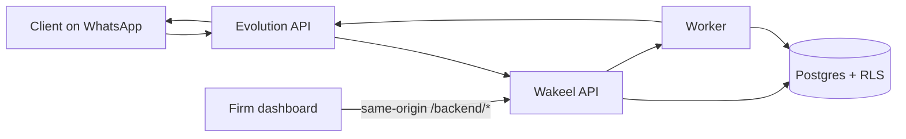

# Wakeel

**The WhatsApp front desk for Pakistani law firms.**

Clients already message firms on WhatsApp. Wakeel answers that channel with an AI that intakes, triages, books, and collects documents — then hands a structured brief to a lawyer. The AI never gives legal advice. Staff run the firm from a web dashboard.

[](#stack)
[](#stack)
[](#stack)
[](#stack)

---

## Why this exists

Pakistani law firms live in WhatsApp. Intake, fees, CNIC photos, and “can I talk to the lawyer?” all arrive as unstructured chats. Partners re-read threads, miss the 24-hour messaging window, and still cannot prove the AI did not invent a legal opinion.

Wakeel is built for that workflow — not a generic chatbot bolted onto email.

| Surface | Who | What they do |
|---|---|---|
| **WhatsApp** | Clients | Message the firm’s number. Nothing else to install. |
| **Dashboard** | Owners and invited lawyers | Inbox, escalations, cases, calendar, payments, knowledge, team. |

No client portal. No native apps. WhatsApp is the product for the client, by design.

## Product

- **AI auto-reply** — intake, FAQs from the firm’s knowledge base, appointments, document requests. Toggle on/off per firm.
- **Voice notes** — transcribe inbound audio; optional ElevenLabs voice replies.
- **English, Urdu, Roman Urdu** — replies mirror the client’s last message.
- **Hard escalations** — self-harm, domestic violence, arrest, and tight deadlines skip automation and page a lawyer.
- **Lawyer handoff brief** — facts, documents, open items, next action. Staff do not re-read the whole chat.
- **Inbox** — WhatsApp-style firm inbox: assign, notes, convert to case, approve AI drafts.
- **Cases and documents** — convert qualified chats; RAG over published firm knowledge. Document bytes stay in tenant storage.
- **Calendar** — slot offers on WhatsApp; Google Calendar sync and confirmations.
- **Payments** — JazzCash / EasyPaisa / bank details; proof screenshots verified in Inbox.
- **Team** — owner vs invited lawyer RBAC. Clerk in production; local **dev seam** when keys are absent.

## Product guarantees

These are enforced in schema and code, not just copy.

1. **Tenant isolation** — PostgreSQL RLS with `FORCE`. Every tenant query runs inside `UnitOfWork.withTenant`. App-level filters are defense-in-depth only.
2. **No legal advice** — disclosure on the first AI message; FAQ answers are knowledge-base cited; the model does not predict outcomes.
3. **24-hour WhatsApp window** — proactive sends outside the session use approved templates only.
4. **AI data tiers** — T3 (documents, transcripts, IDs) does not leave for third-party LLMs by default. Outbox events are identifiers and statuses, never message bodies.
5. **Ack-fast webhooks** — persist, acknowledge, process asynchronously. Idempotent consumers.

Why each of those exists: [`docs/decision-log.md`](docs/decision-log.md).

## Architecture



The browser never talks to the API on a second origin. Next.js rewrites `/backend/*` to the API (nginx does the same in production). There is no CORS trust model.

## Stack

| Layer | Choice |
|---|---|
| Dashboard | Next.js 16, React 19, Tailwind v4, shadcn/ui (Base UI), TanStack Query, Clerk v7 |
| API / worker | NestJS 11, one image, `API_ROLE=api\|worker` |
| Data | PostgreSQL 16 + pgvector, Redis, BullMQ, Prisma 7 |
| WhatsApp | Self-hosted [Evolution API](https://github.com/EvolutionAPI/evolution-api) (Baileys or Cloud API per tenant) |
| Auth | Clerk organizations; env-gated **dev seam** (`x-tenant-id`) when keys are missing |
| Browser → API | Same-origin `/backend/*` rewrites |

```
lawyer-agency/
├── apps/api               Nest API + worker
├── apps/web               Next dashboard + marketing site
├── infra/                 Postgres image, nginx, migrate
├── docs/                  Phases, ENV_SETUP, decision log
├── docker-compose.yml     Local data plane + API + worker
└── docker-compose.prod.yml  API, worker, web, nginx
```

## Quick start

**Requirements:** Node 20+, Docker Compose.

```bash
git clone https://github.com/baigcoder/lawyer-agency.git
cd lawyer-agency
git checkout dev

cp .env.example apps/api/.env
cp .env.example apps/web/.env.local

# Field encryption for per-tenant WhatsApp tokens (exactly 64 hex chars)
openssl rand -hex 32
# paste into apps/api/.env → MASTER_ENCRYPTION_KEY=

npm install
docker compose up -d          # Postgres, Redis, Evolution, migrate, seed, API, worker
PORT=3002 npm run dev -w @app/web
```

`docker compose` does **not** start the dashboard. Run Next locally so `/backend/*` can proxy to the API on `:3001`. Use port **3002** so it matches `APP_PUBLIC_URL`.

| Service | URL |
|---|---|
| Dashboard | http://localhost:3002 |
| Inbox (dev seam) | http://localhost:3002/dashboard/inbox |
| API health | http://localhost:3001/health |
| Evolution | http://localhost:8080 |

Without Clerk keys, both apps use the **dev seam**. Seed creates the tenant whose id is `NEXT_PUBLIC_DEV_TENANT_ID` in `.env.example`. Open `/dashboard` — no sign-in required.

Full key-acquisition guide (Clerk, OpenAI, Anthropic, Google, ElevenLabs, Supabase, VAPID, SMTP, Sentry): **[`docs/ENV_SETUP.md`](docs/ENV_SETUP.md)**.

### Useful commands

```bash
npm run build                                      # both workspaces
cd apps/api && npx vitest run                      # API unit tests
cd apps/api && npx eslint "src/**/*.ts"
cd apps/api && npx tsc -p tsconfig.build.json --noEmit

# Production-shaped stack (Phase 15)
docker compose -f docker-compose.prod.yml up -d migrate
docker compose -f docker-compose.prod.yml up -d
curl http://localhost/health
```

After API schema or service changes: type-check, lint, tests, then migrate and rebuild **api + worker**.

## Security

| Concern | How Wakeel handles it |
|---|---|
| Cross-tenant reads | RLS + `FORCE`; GUC `app.tenant_id` per transaction |
| WhatsApp tokens | AES-256-GCM; master key from env |
| Webhooks | Verify, persist raw event, ack under 500ms, process async |
| Secrets | Never committed. `.env` and `.env.local` are gitignored |
| Config | Zod-validated at boot; fail fast |
| Module boundaries | A module imports another module’s exported application service only |

This is not legal advice and not a substitute for counsel review of PECA / PDPB / PBC obligations for a given deployment.

## Status

Phases **1–15** (requirements through production-shaped compose) are in the tree. Already shipped on top of that: Evolution transport, AI auto-reply, document RAG, Google Calendar, owner/lawyer RBAC, lawyer handoff briefs.

**Next:** hosting target, backups, alerting, staging smoke tests. Tracked in [`docs/backlog/pk-tier1.md`](docs/backlog/pk-tier1.md).

Active development branch: **`dev`**.

## Docs

| Doc | What it is |
|---|---|
| [`docs/decision-log.md`](docs/decision-log.md) | Every architectural and product decision, with rejected alternatives |
| [`docs/ENV_SETUP.md`](docs/ENV_SETUP.md) | How to obtain every API key |
| [`docs/phases/`](docs/phases/) | Build log, phase by phase |
| [`AGENTS.md`](AGENTS.md) | Hard rules for anyone (or any agent) changing code |

## License

Private source. All rights reserved unless a license file is added to this repository.
