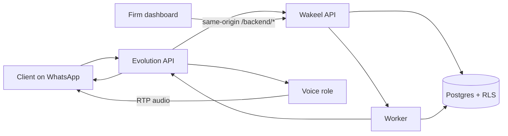
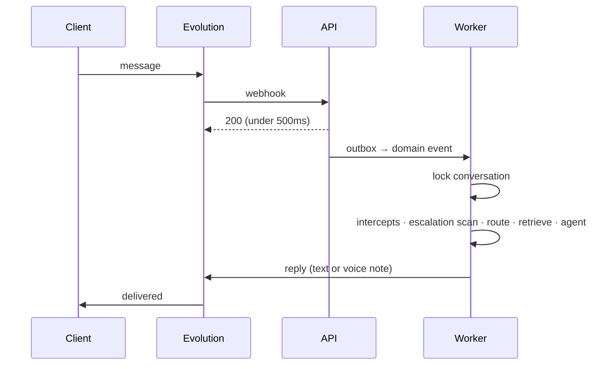

# Wakeel

**The WhatsApp front desk for Pakistani law firms.**

Clients already message firms on WhatsApp. Wakeel answers that channel with an AI that intakes, triages, books, collects documents, and answers live calls — then hands a structured brief to a lawyer. The AI never gives legal advice. Staff run the firm from a web dashboard.

[](#stack)
[](#stack)
[](#stack)
[](#stack)

---

## Why this exists

Pakistani law firms live in WhatsApp. Intake, fees, CNIC photos, and "can I talk to the lawyer?" all arrive as unstructured chats. Partners re-read threads, miss the 24-hour messaging window, and still cannot prove the AI did not invent a legal opinion.

Wakeel is built for that workflow — not a generic chatbot bolted onto email.

| Surface | Who | What they do |
|---|---|---|
| **WhatsApp** | Clients | Message or call the firm's number. Nothing else to install. |
| **Dashboard** | Owners and invited lawyers | Inbox, escalations, cases, calendar, payments, knowledge, team. |

No client portal. No native apps. WhatsApp is the product for the client, by design.

## Product

- **AI auto-reply** — intake, FAQs grounded in the firm's knowledge base, appointments, document requests. Toggle on/off per firm.
- **Voice notes** — inbound audio transcribed; optional spoken replies.
- **Live AI calls** — the receptionist answers a WhatsApp call, books a slot, and escalates. See [Voice](#voice).
- **English, Urdu, Roman Urdu** — replies mirror the client's script. See [Language](#language).
- **Hard escalations** — self-harm, domestic violence, arrest, and tight deadlines skip automation and page a lawyer.
- **Lawyer handoff brief** — facts, documents, open items, next action. Staff do not re-read the whole chat.
- **Inbox** — WhatsApp-style firm inbox: assign, notes, convert to case, approve AI drafts.
- **Cases and documents** — convert qualified chats; RAG over published firm knowledge and client files. Document bytes stay in tenant storage.
- **Calendar** — slot offers on WhatsApp; Google Calendar sync and confirmations.
- **Payments** — JazzCash / EasyPaisa / bank details; proof screenshots verified in Inbox.
- **Team** — owner vs invited lawyer RBAC. Clerk in production; local **dev seam** when keys are absent.

## Product guarantees

These are enforced in schema and code, not just copy.

1. **Tenant isolation** — PostgreSQL RLS with `FORCE`. Every tenant query runs inside `UnitOfWork.withTenant`. App-level filters are defense-in-depth only.
2. **No legal advice** — disclosure on the first AI message; FAQ answers are knowledge-base cited; the model does not predict outcomes.
3. **24-hour WhatsApp window** — proactive sends outside the session use approved templates only.
4. **AI data tiers** — T3 (documents, transcripts, IDs) does not leave for third-party LLMs by default. Outbox events are identifiers and statuses, never message bodies.
5. **Ack-fast webhooks** — persist, acknowledge, process asynchronously. Idempotent consumers.

Why each of those exists: [`docs/decision-log.md`](docs/decision-log.md).

## Architecture



The browser never talks to the API on a second origin. Next.js rewrites `/backend/*` to the API (nginx does the same in production). There is no CORS trust model.

One image runs three roles, selected by `API_ROLE`:

| Role | Responsibility |
|---|---|
| `api` | HTTP, webhooks, dashboard queries. Enqueues; never consumes. |
| `worker` | Outbox dispatch, domain events, the AI pipeline, media, notifications. |
| `voice` | Live WhatsApp calls — WebRTC/SIP audio, STT, the receptionist loop, TTS. Needs real host ports for RTP. |

## How a message becomes a reply

Inbound WhatsApp messages are acknowledged immediately and processed off a queue. A single turn looks like this:



The worker's turn, in order:

1. **Idempotency** — a message whose turn already completed is skipped. A retried job cannot answer the same client twice.
2. **Conversation lock** — one AI turn per conversation at a time, via a Redis mutex. A busy conversation is re-queued, not blocked on. WhatsApp users send short consecutive messages, so without this two turns raced and replied twice.
3. **Deterministic intercepts** — payment details, appointment booking, and document requests are handled without a model where the intent is unambiguous.
4. **Escalation scan** — unambiguous phrases escalate immediately. Ambiguous legal vocabulary ("police station", "bail", "murder" — the everyday words of a law firm's inbox) goes to a triage model instead of hard-escalating; if the model is unavailable it escalates anyway, because a missed emergency costs more than an unnecessary handoff.
5. **Routing** — a heuristic fast-route handles common turns; anything less certain goes to the router model.
6. **Retrieval** — pgvector over published knowledge plus the client's own documents, with a relevance floor so noise is not treated as knowledge.
7. **Agent** — intake, FAQ, case-update, or greeting. Every call is schema-validated and logged to `ai_logs`.
8. **Send** — text, or a voice note when the client sent audio.

Every model call has a deterministic fallback. A provider outage degrades the reply; it does not drop the client's message.

## Voice

### Voice notes

Inbound audio is transcribed by racing ElevenLabs Scribe against Whisper, preferring whichever returns Urdu script — Whisper often transliterates Urdu into Latin, which reads badly and routes badly. Replies are synthesized back as Ogg/Opus push-to-talk notes.

### Live calls

`API_ROLE=voice` answers WhatsApp calls end to end: WebRTC for Cloud API numbers, Wavoip SIP for QR/Baileys numbers, and a missed-call WhatsApp follow-up when neither connects.

The receptionist can capture intake, offer and book real calendar slots, answer from the knowledge base, and escalate to a lawyer. Notable properties:

- **Barge-in.** The caller can interrupt mid-sentence; playback aborts and listening resumes.
- **Real-time pacing.** RTP frames leave at the rate they are played. Sending a whole turn as a burst overruns the receiver's jitter buffer and is heard as clipped speech.
- **Language locked once.** The first caller utterance decides the call's language, and it does not change again mid-call.
- **Spoken, not written.** Slot times are spoken as words, never as timestamps.

## Language

Replies mirror the client: English stays English, Urdu script stays Urdu script, Roman Urdu stays Roman Urdu. Spoken replies are different, and the difference matters:

| Concern | Written reply | Spoken reply |
|---|---|---|
| Script | mirrors the client | Urdu **script** only — a voice reads Latin letters with English phonetics |
| Numbers | `25000` | `پچیس ہزار` |
| Times | `4:30 PM` | `شام ساڑھے چار بجے` |
| Borrowed terms | `CNIC`, `WhatsApp` | `شناختی کارڈ`, `واٹس ایپ` |
| Verb gender | either | agrees with the configured voice — Urdu verbs inflect for the speaker |

Urdu and English use separate TTS voices. English stock voices can pronounce Urdu but carry an anglophone accent, so set `ELEVENLABS_VOICE_ID_URDU_*` to a Hindi or Urdu voice from your library — Hindi and Urdu are the same spoken language in different scripts.

> The ElevenLabs API key needs the **`voices_read`** permission, or the dashboard voice picker cannot list your library and silently shows built-in English voices only.

## Reliability

| Failure | Behaviour |
|---|---|
| Job retried after a successful send | Skipped — the turn is marked complete after the send |
| Two messages arrive together | Serialized per conversation; the second is re-queued, not dropped |
| LLM 5xx, timeout, dropped socket | Retried with jittered backoff under a total deadline |
| LLM returns unusable JSON | Resampled once before giving up |
| Model unavailable | Deterministic fallback reply; the turn still completes |
| TTS rate-limited (429) | Retried on the **same** model — switching models cannot clear a concurrency limit |
| TTS fails entirely | Falls back to another model, then a local engine, then text |
| Embeddings unavailable | Vector search degrades to keyword retrieval |
| Redis unreachable | Conversation lock is skipped rather than dropping the message |

## Cost control

Model choice is per agent, not global: cheap models route and triage, larger ones write client-facing text. Defaults target Groq's OpenAI-compatible endpoint, so a development stack runs on free-tier models.

Every call is written to `ai_logs` with provider, model, latency, tokens, and cost in micro-dollars, priced from the model actually used. Tenants can carry a monthly budget cap; exceeding it degrades to handoff rather than billing on.

> TTS and STT spend is **not** yet metered or capped. ElevenLabs bills per character and is likely the largest variable cost per tenant.

## Stack

| Layer | Choice |
|---|---|
| Dashboard | Next.js 16, React 19, Tailwind v4, shadcn/ui (Base UI), TanStack Query, Clerk v7 |
| API / worker / voice | NestJS 11, one image, `API_ROLE=api\|worker\|voice` |
| Data | PostgreSQL 16 + pgvector, Redis, BullMQ, Prisma 7 |
| WhatsApp | Self-hosted [Evolution API](https://github.com/EvolutionAPI/evolution-api) (Baileys or Cloud API per tenant) |
| Live call audio | werift WebRTC, Wavoip SIP, Opus |
| AI | OpenAI-compatible chat (Groq by default), pgvector RAG, ElevenLabs + Whisper speech |
| Auth | Clerk organizations; env-gated **dev seam** (`x-tenant-id`) when keys are missing |
| Browser → API | Same-origin `/backend/*` rewrites |

```
lawyer-agency/
├── apps/api               Nest API + worker + voice roles
│   ├── prisma/            Schema and 27 migrations
│   └── src/modules/       18 bounded modules (ai, voice, voice-calls, rag, …)
├── apps/web               Next dashboard + marketing site
├── infra/                 Postgres image, nginx, Evolution, migrate
├── docs/                  Phases, ENV_SETUP, decision log, backlog
├── docker-compose.yml     Local data plane + api + worker + voice
└── docker-compose.prod.yml  API, worker, web, nginx
```

## Quick start

**Requirements:** Node 20+, Docker Compose.

```bash
git clone https://github.com/baigcoder/lawyer-agency.git
cd lawyer-agency
git checkout dev

cp .env.example apps/api/.env
cp .env.example apps/web/.env.local

# Field encryption for per-tenant WhatsApp tokens (exactly 64 hex chars)
openssl rand -hex 32
# paste into apps/api/.env → MASTER_ENCRYPTION_KEY=

npm install
docker compose up -d          # Postgres, Redis, Evolution, migrate, seed, api, worker, voice
PORT=3002 npm run dev -w @app/web
```

`docker compose` does **not** start the dashboard. Run Next locally so `/backend/*` can proxy to the API on `:3001`. Use port **3002** so it matches `APP_PUBLIC_URL`.

| Service | URL |
|---|---|
| Dashboard | http://localhost:3002 |
| Inbox (dev seam) | http://localhost:3002/dashboard/inbox |
| API health | http://localhost:3001/health |
| Evolution | http://localhost:8080 |

Without Clerk keys, both apps use the **dev seam**. Seed creates the tenant whose id is `NEXT_PUBLIC_DEV_TENANT_ID` in `.env.example`. Open `/dashboard` — no sign-in required.

The AI pipeline needs **one** chat key (`GROQ_API_KEY` or `OPENAI_API_KEY`) to reply at all. Speech is optional: without `ELEVENLABS_API_KEY` the assistant stays text-only. Full key-acquisition guide: **[`docs/ENV_SETUP.md`](docs/ENV_SETUP.md)**.

### Useful commands

```bash
npm run build                                      # both workspaces
cd apps/api && npx prisma generate                 # after any schema change
cd apps/api && npx vitest run                      # API unit tests
cd apps/api && npx eslint "src/**/*.ts"            # includes module-boundary rules
cd apps/api && npx tsc -p tsconfig.build.json --noEmit

# Production-shaped stack (Phase 15)
docker compose -f docker-compose.prod.yml up -d migrate
docker compose -f docker-compose.prod.yml up -d
curl http://localhost/health
```

After API schema or service changes: `prisma generate`, type-check, lint, tests, then migrate and rebuild **api + worker + voice**.

> Use the **full** type-check, not an incremental Nest build — a stale `tsbuildinfo` hides errors after refactors and file moves.

### Testing

104 spec files run under Vitest, colocated with the code they cover. The AI, voice, and language layers are deliberately built as pure functions — language detection, escalation keyword tiers, Urdu number and clock rendering, model fallback plans, cost arithmetic, RTP pacing — so the parts that are hardest to observe in production are the easiest to test.

## Troubleshooting

| Symptom | Cause |
|---|---|
| `Property 'voiceCall' does not exist` and similar type errors | Stale generated Prisma client. Run `npx prisma generate` in `apps/api`. |
| Dashboard voice picker shows only English voices | The ElevenLabs key lacks `voices_read`. |
| Urdu replies read out digits or English words | Text reached TTS un-normalized — check it went through `prepareSpokenTtsText`. |
| Embedding insert fails on dimensions | `EMBEDDING_DIMENSIONS` must match the `vector(n)` column; the v3 models need an explicit `dimensions`. |
| Client receives the same reply twice | The turn-completed marker was not written — check worker logs around the send. |
| Live call is silent | No live WebRTC media. Check the `voice` role's published RTP ports; Docker Desktop's `host` network is the VM, not your LAN. |

## Security

| Concern | How Wakeel handles it |
|---|---|
| Cross-tenant reads | RLS + `FORCE`; GUC `app.tenant_id` per transaction |
| WhatsApp tokens | AES-256-GCM; master key from env |
| Webhooks | Verify, persist raw event, ack under 500ms, process async |
| Secrets | Never committed. `.env` and `.env.local` are gitignored |
| Config | Zod-validated at boot; fail fast |
| Module boundaries | A module imports another module's exported application service only |

This is not legal advice and not a substitute for counsel review of PECA / PDPB / PBC obligations for a given deployment.

## Status

Phases **1–15** (requirements through production-shaped compose) are in the tree. Shipped on top of that: Evolution transport, AI auto-reply, document RAG, Google Calendar, owner/lawyer RBAC, lawyer handoff briefs, live WhatsApp calls.

**Next:** hosting target, backups, alerting, staging smoke tests, and metering speech spend. Tracked in [`docs/backlog/pk-tier1.md`](docs/backlog/pk-tier1.md).

Active development branch: **`dev`**.

## Docs

| Doc | What it is |
|---|---|
| [`docs/decision-log.md`](docs/decision-log.md) | Every architectural and product decision, with rejected alternatives |
| [`docs/ENV_SETUP.md`](docs/ENV_SETUP.md) | How to obtain every API key |
| [`docs/phases/`](docs/phases/) | Build log, phase by phase |
| [`docs/backlog/pk-tier1.md`](docs/backlog/pk-tier1.md) | What is next |
| [`AGENTS.md`](AGENTS.md) | Hard rules for anyone (or any agent) changing code |

## License

Private source. All rights reserved unless a license file is added to this repository.
