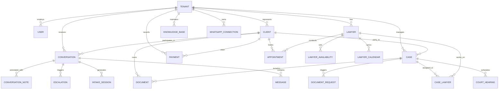

# Wakeel — Information Architecture (Core Product)

**Status:** IMPLEMENTED BASELINE & ROUTE SPECIFICATION  
**Classification:** Product Information Architecture, Entity Hierarchies, and Navigation Taxonomies  
**Cross-References:** `apps/web/src/app/(dashboard)/dashboard/`, `apps/api/src/modules/`

---

## 1. High-Level System Structure

The Wakeel platform is divided into four distinct operational zones:

```text
┌─────────────────────────────────────────────────────────────────────────────┐
│                             WAKEEL PLATFORM                                  │
├───────────────────┬───────────────────┬──────────────────┬──────────────────┤
│ 1. PUBLIC & AUTH  │ 2. FIRM SETUP     │ 3. DASHBOARD     │ 4. WHATSAPP EDGE │
│    SURFACES       │    & ONBOARDING   │    OPERATIONS    │    (CLIENT ONLY) │
├───────────────────┼───────────────────┼──────────────────┼──────────────────┤
│ • / (Landing EN)  │ • /onboarding     │ • /dashboard     │ • Text Messages  │
│ • /demo           │   (Org & Wizard)  │   (Overview)     │ • Audio Notes    │
│ • /sign-in        │ • /setup          │ • /inbox         │ • PDF / Photos   │
│ • /sign-up        │   (3-step Hub)    │ • /cases         │ • Live Calls     │
│ • /terms          │                   │ • /calendar      │   (WebRTC / SIP) │
│ • /privacy        │                   │ • /escalations   │ • Fee Prompts    │
│ • /data-deletion  │                   │ • /documents     │ • Confirmations  │
│                   │                   │ • /knowledge     │                  │
│                   │                   │ • /payments      │                  │
│                   │                   │ • /analytics     │                  │
│                   │                   │ • /team          │                  │
│                   │                   │ • /whatsapp      │                  │
│                   │                   │ • /settings      │                  │
└───────────────────┴───────────────────┴──────────────────┴──────────────────┘
```

---

## 2. Navigational Taxonomy & Sectional Grouping

The dashboard navigation (`apps/web/src/lib/dashboard-nav.ts`) is structured into four functional groups, aligned with the operational rhythms of a Pakistani law firm:

### Group 1: Main (Daily Operational Flow)
- **Overview (`/dashboard`):** Real-time command center showing priority metrics, SLA breaches, quick AI controls, funnel summary, and today's court/consultation calendar.
- **Priority Inbox (`/dashboard/inbox`):** Full-screen split-pane communication hub with real-time WhatsApp Web look-and-feel, audio note player, case conversion, internal notes, and manual reply capabilities.
- **Escalations (`/dashboard/escalations`):** Dedicated triage queue for safety-triggered matters (domestic violence, arrest, urgent court dates) displaying structured lawyer handoff briefs.

### Group 2: Manage (Casework & Legal Knowledge)
- **Cases (`/dashboard/cases`):** Matter registry tracking lifecycle states (`LEAD` → `CONSULTATION` → `ENGAGED` → `IN_COURT` → `CLOSED`), case reference numbers, urgency ratings, and court hearings.
- **Documents (`/dashboard/documents`):** Two-tiered document repository organizing client files by client folder or specific case, with pinned status and RAG chunking indicators.
- **Knowledge Base (`/dashboard/knowledge`):** Verified firm knowledge repository where advocates author and publish FAQ answers that ground automated client responses.
- **Calendar (`/dashboard/calendar`):** Monthly/weekly schedule combining client consultation bookings with court hearing dates and lawyer Google Calendar synchronization.
- **Team (`/dashboard/team`):** Firm roster managing advocate profiles, practice area specialties, weekly availability matrices, and Clerk organization invitations.

### Group 3: Firm (Business & Channels)
- **WhatsApp Management (`/dashboard/whatsapp`):** Official WhatsApp Business API settings, Meta verification status, phone number provisioning, and Evolution API instance health.
- **Payments (`/dashboard/payments`):** Pakistan fee collection ledger tracking JazzCash, Easypaisa, and bank transfers, fee instructions, screenshot proof verification, and PDF receipts.
- **Analytics (`/dashboard/analytics`):** Operational performance reporting covering lead conversion funnels, practice-area revenue breakdown, AI automation ratios, and SLA compliance.
- **Settings (`/dashboard/settings`):** Firm profile, owner credentials, voice receptionist settings, ElevenLabs voice previews, bank account details, and notification channels.

### Group 4: System (Setup & Onboarding)
- **Setup Hub (`/dashboard/setup`):** Progressive 3-step launchpad guiding new firms through profile setup, QR pairing, and interactive simulated test messaging.

---

## 3. Core Domain Entities & Relationships



---

## 4. Permission-Based Information Access Hierarchy

Information visibility and write access are strictly partitioned across three primary firm roles (`apps/web/src/lib/permissions.ts`, `D-116`):

| Entity / Workspace Section | Firm Owner / Partner | Associate Lawyer | Legal Clerk / Staff (*Munshi*) |
|---|---|---|---|
| **Overview & Metrics** | Full firm-wide view + revenue | Assigned cases + today's hearings | Active intake queue + court diary |
| **Priority Inbox** | View & reply to all threads | View & reply to assigned threads | Read & send intake messages |
| **Escalations & Handoffs** | Acknowledge, resolve, reassign | Acknowledge & resolve assigned | View only |
| **Cases & Court Diary** | Create, transition, close, archive | Update status, manage hearings | Log court hearing dates |
| **Client Documents** | Upload, delete, view, pin | Upload, view, pin | Upload & view non-privileged |
| **Knowledge Base** | Author, publish, delete | Propose draft entries | Read-only |
| **Fee Collection & Payments** | View revenue, verify screenshots | Request consultation fee | Mark cash/manual fee received |
| **Team & Availability** | Invite staff, edit lawyers, set fees | Edit own availability & bio | View roster |
| **AI & Receptionist Settings** | Toggle auto-reply, voice, prompts | View active settings | No access |
