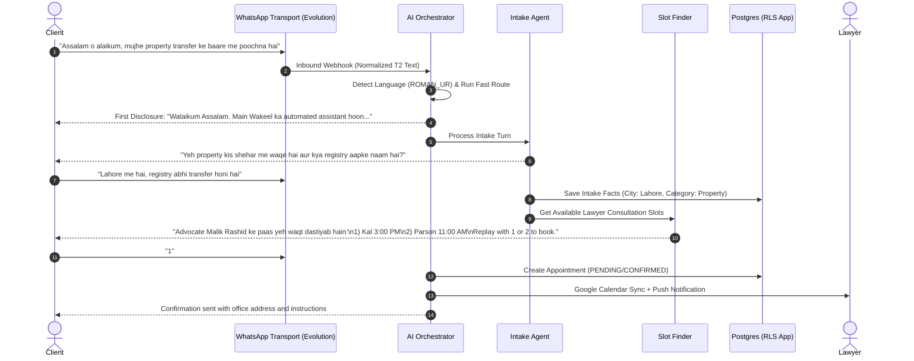
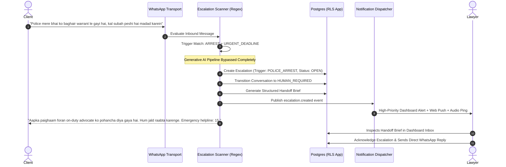
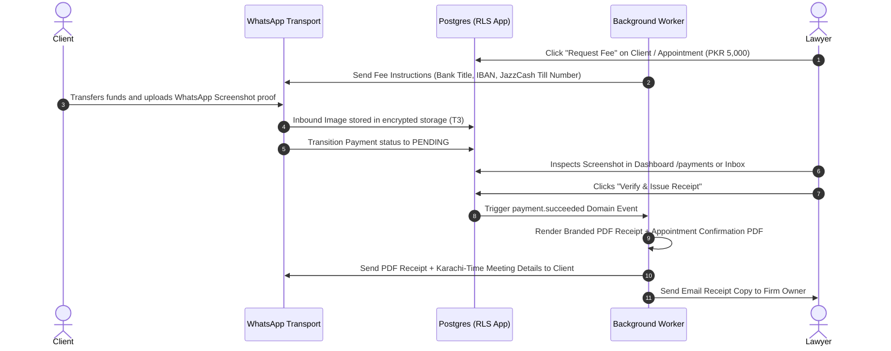

# Wakeel — User Journeys

**Status:** IMPLEMENTED BASELINE & LIFECYCLE SPECIFICATION  
**Classification:** End-to-End User Journeys and Operational Flows  
**Cross-References:** `docs/phases/phase-01-product-requirements.md`, `docs/decision-log.md` (D-109 to D-125)

---

## Journey 1: Client WhatsApp Intake & Consultation Booking

**Actor:** Prospective Client (Litigant)  
**Channel:** WhatsApp  
**Language:** Urdu / Roman Urdu / English  

---

## Journey 2: Emergency Safety Escalation & Lawyer Handoff

**Actor:** Distressed Client in Crisis  
**Trigger:** Keyword match (Domestic Violence, Active Police Custody/FIR, Threat of Self-Harm, Immediate Court Deadline ≤48h)  

---

## Journey 3: Fee Collection, Screenshot Verification & PDF Receipt

**Actor:** Client & Law Firm Managing Partner / Clerk  
**Context:** Consultation Fee or Retainer Payment via JazzCash / Easypaisa / Bank Transfer  

---

## Journey 4: Firm Onboarding, QR Pairing & Simulated Test

**Actor:** Law Firm Managing Partner  
**Surface:** Next.js Dashboard (`/onboarding` & `/dashboard/setup`)  

1. **Clerk Signup & Org Creation:** Partner signs up with email, creates organization `"Malik & Associates Legal Consultants"`.
2. **Onboarding Wizard (`/onboarding`):**
   - Step 1: Legal name, city (Lahore), office address, team size.
   - Step 2: Practice areas (Civil Litigation, Family Law, Property/Real Estate).
   - Step 3: Supported languages (`EN`, `UR`, `ROMAN_URDU`), office hours (9:00 AM – 6:00 PM).
   - Step 4: Admin confirmation.
3. **Setup Hub (`/dashboard/setup`):**
   - Step 1: Profile review and verification.
   - Step 2: Connect WhatsApp: Displays real-time Evolution API QR code. Advocate scans QR with firm WhatsApp phone. Socket transitions to `connected`.
   - Step 3: Interactive Simulated AI Test: Advocate sends a pretend client message directly from the UI (`"Mujhe talaq aur khula ke mutalliq maloomat chahiye"`). Full AI pipeline processes the message and renders the live generated reply in the UI sandbox.
4. **Go-Live:** Firm connects with clients with zero Meta verification roadblocks.
