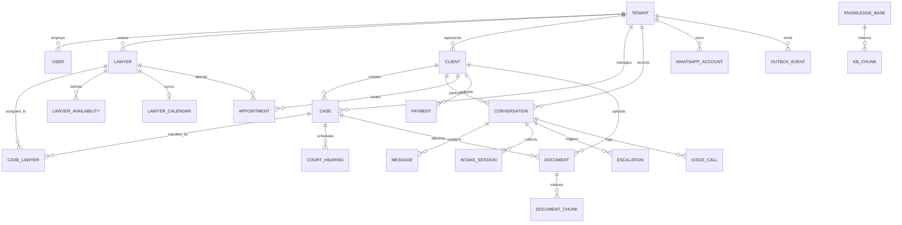

# Database Schema Overview — Dual-Schema Multi-Tenant Architecture

## 1. Architectural Foundation & Tenancy Model

The Wakeel data plane is architected around PostgreSQL 16 with a strict dual-schema isolation pattern ([D-001](file:///f:/lawyer_agency/docs/decision-log.md), [D-002](file:///f:/lawyer_agency/docs/decision-log.md)). Designed for legal practices in Pakistan operating under strict advocate-client confidentiality and the Pakistan Bar Council Canons of Professional Conduct, tenant isolation is enforced at the database kernel level through PostgreSQL Row-Level Security (`FORCE ROW LEVEL SECURITY`) and transaction-scoped configuration variables (`SET LOCAL app.tenant_id`).

```
                    ┌────────────────────────────────────────────────────────┐
                    │                 PostgreSQL 16 Instance                 │
                    │                                                        │
                    │  ┌──────────────────────┐    ┌──────────────────────┐  │
                    │  │   platform schema    │    │      app schema      │  │
                    │  │  (Shared / Global)   │    │   (Tenant-Isolated)  │  │
                    │  │                      │    │                      │  │
                    │  │ • tenants            │    │ • roles              │  │
                    │  │ • platform_users     │    │ • users              │  │
                    │  │ • permissions        │    │ • lawyers            │  │
                    │  │ • prompt_versions    │    │ • clients            │  │
                    │  │ • webhook_events     │    │ • cases              │  │
                    │  │ • outbox_events      │    │ • conversations      │  │
                    │  │ • wa_routes          │    │ • messages (pt)      │  │
                    │  │ • tenant_features    │    │ • voice_calls        │  │
                    │  │ • analytics_daily    │    │ • documents          │  │
                    │  │                      │    │ • document_chunks    │  │
                    │  │   (No Tenant RLS)    │    │ • kb_chunks          │  │
                    │  │ (Infrastructure/Ops) │    │ • appointments       │  │
                    │  │                      │    │ • payments           │  │
                    │  │                      │    │ • audit_logs (pt)    │  │
                    │  │                      │    │ • ai_logs (pt)       │  │
                    │  │                      │    │                      │  │
                    │  │                      │    │ [FORCE RLS ENFORCED] │  │
                    │  └──────────────────────┘    └──────────────────────┘  │
                    └────────────────────────────────────────────────────────┘
```

### 1.1 Schema Partitioning: `platform` vs `app`

| Schema | Scope & Security Posture | Table Count | Primary Responsibilities |
| :--- | :--- | :--- | :--- |
| **`platform`** | Cross-tenant infrastructure. No tenant-level RLS policies (except self-read on `tenants`). Accessible by infrastructure services, webhooks, and outbox dispatchers. | 9 Tables | Tenant registry, Clerk organization mapping, global permission catalog, prompt version registry, pre-tenant webhook inbox, transactional outbox, phone number router, billing features, and daily rollups. |
| **`app`** | Tenant-isolated application domain. `FORCE ROW LEVEL SECURITY` enabled on every table. Every row contains `tenantId UUID NOT NULL` pointing to `platform.tenants(id)`. | 34 Tables | Legal cases, clients, WhatsApp conversations, partitioned chat messages, voice call logs, document storage & vector chunks, lawyer diaries, appointments, fee payments, and tamper-proof audit trails. |

---

## 2. PostgreSQL Role & Security Model

The database enforces a two-role separation of duties ([0002_rls_and_constraints](file:///f:/lawyer_agency/apps/api/prisma/migrations/0002_rls_and_constraints/migration.sql)):

1. **`postgres` (Owner Role / Migrator):**
   - Holds `BYPASSRLS` and superuser privileges.
   - Used solely during Docker provisioning, database creation, extension management (`vector`, `pgcrypto`, `btree_gist`), and Prisma migration execution (`MIGRATION_DATABASE_URL`).
   - Never exposed to application runtime traffic.
2. **`app_user` (Application Runtime Role):**
   - Configured with `NOINHERIT NOBYPASSRLS`.
   - Used by the NestJS monolith across all roles (`API_ROLE=api`, `API_ROLE=worker`, `API_ROLE=voice`) via `DATABASE_URL`.
   - Granted standard DML (`SELECT, INSERT, UPDATE, DELETE`) on `app` tables, but explicitly revoked from `UPDATE` and `DELETE` on `app.audit_logs` (ensuring append-only compliance).
   - Constrained by PostgreSQL RLS on all `app` tables:
     ```sql
     CREATE POLICY tenant_isolation ON app.<table_name>
       USING ("tenantId" = NULLIF(current_setting('app.tenant_id', true), '')::uuid)
       WITH CHECK ("tenantId" = NULLIF(current_setting('app.tenant_id', true), '')::uuid);
     ```

### 2.1 Fail-Closed Guarantee

If an application query executes without setting `app.tenant_id` (or if it is set to an empty string), `current_setting('app.tenant_id', true)` returns `''`, `NULLIF` evaluates to `NULL`, and the comparison `("tenantId" = NULL)` evaluates to `UNKNOWN` (falsy). **Zero rows are returned, and zero rows can be modified or inserted.**

---

## 3. Entity-Relationship Topology



---

## 4. Model Catalog Summary

### 4.1 Platform Schema (9 Models)
1. [`Tenant`](file:///f:/lawyer_agency/apps/api/prisma/schema.prisma#L386): Law firm account, subscription status, AI budget limits, retention overrides, and firm profile.
2. [`PlatformUser`](file:///f:/lawyer_agency/apps/api/prisma/schema.prisma#L447): Global administrative operators and Wakeel platform engineers.
3. [`Permission`](file:///f:/lawyer_agency/apps/api/prisma/schema.prisma#L459): System-defined RBAC capability codes (`case:read`, `payment:refund`, `ai:override`).
4. [`PromptVersion`](file:///f:/lawyer_agency/apps/api/prisma/schema.prisma#L472): Versioned prompt registry pinning template text, sha256 hash, and agent target.
5. [`WebhookEvent`](file:///f:/lawyer_agency/apps/api/prisma/schema.prisma#L494): Inbound webhook idempotency inbox for Meta Cloud API and Evolution API webhooks.
6. [`OutboxEvent`](file:///f:/lawyer_agency/apps/api/prisma/schema.prisma#L515): Transactional outbox table storing domain events for asynchronous dispatch to BullMQ.
7. [`WaRoute`](file:///f:/lawyer_agency/apps/api/prisma/schema.prisma#L534): Pre-RLS routing table mapping Meta `phoneNumberId` to tenant and WABA IDs.
8. [`TenantFeature`](file:///f:/lawyer_agency/apps/api/prisma/schema.prisma#L549): Entitlement flags (`OFFICIAL_WHATSAPP`) governing paid add-on access.
9. [`AnalyticsDaily`](file:///f:/lawyer_agency/apps/api/prisma/schema.prisma#L1165): Aggregated daily firm metrics (conversations, AI handle rate, fees collected).

### 4.2 App Schema (34 Models)
- **Identity & RBAC:** `Role`, `RolePermission`, `User`, `Lawyer`, `LawyerAvailability`, `LawyerCalendar`, `LawyerCaseHighlight`.
- **CRM & Client Intake:** `Client`, `Case`, `CaseLawyer`, `Conversation`, `ConversationNote`, `IntakeSession`, `Escalation`.
- **Communications & Voice:** `Message` (Partitioned), `VoiceCall`, `WhatsappAccount`, `PilotSession`, `WhatsappTemplate`, `WhatsappConnection`.
- **Document Management & Knowledge:** `Document`, `DocumentChunk` (pgvector 384), `DocumentRequest`, `KnowledgeBase`, `KbChunk` (pgvector 384).
- **Practice Operations & Billing:** `Appointment`, `CourtHearing`, `Payment`, `FirmPaymentDetails`.
- **Notifications & Audit:** `Notification`, `PushSubscription`, `AuditLog` (Partitioned, append-only), `AiLog` (Partitioned), `PromptLog`.

---

## 5. Key Database Capabilities Not Expressible in Prisma

Because Prisma 7 ORM cannot declare specialized PostgreSQL engine features directly in `schema.prisma`, these critical database constructs are managed via native SQL migrations in `apps/api/prisma/migrations/`:

1. **Row-Level Security & Default Roles:** Configured in `0002_rls_and_constraints` using dynamic PL/pgSQL loops.
2. **Range Partitioning:** `messages`, `audit_logs`, and `ai_logs` are partitioned by month on `createdAt` in `0003_partitions_and_vector`.
3. **Exclusion Constraints (Double-Booking Prevention):** `app.appointments` enforces non-overlapping time ranges per lawyer using `btree_gist` and `tstzrange` in `0002_rls_and_constraints`.
4. **Vector Embeddings & HNSW Indexes:** 384-dimensional cosine distance indexes on `document_chunks` and `kb_chunks` using `pgvector` in `0003`, `0027`, and `0029`.
5. **Partial Unique Indexes:** Idempotency for payment gateways (`providerTxnId`) where `NULL` manual entries are permitted without conflict (`0002_rls_and_constraints`).
