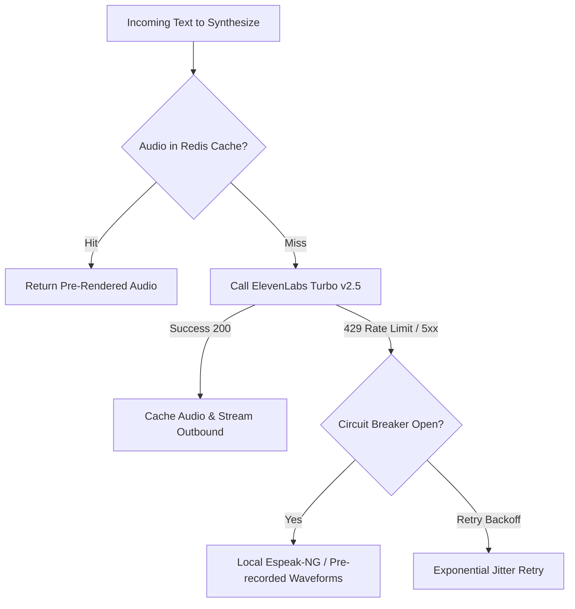

# ElevenLabs Speech Synthesis Integration — Urdu & English Audio

## 1. Overview & Voice Persona Strategy

Voice interactions are essential for accessibility in Pakistan, where literacy rates vary and spoken Urdu (along with regional languages) is the universal mode of legal consultation.

Wakeel integrates **ElevenLabs Turbo v2.5** (`eleven_turbo_v2_5`) across two operational touchpoints:
1. **Asynchronous WhatsApp Voice Notes:** AI agent generates native voice note replies (`.ogg` Opus) in the client's preferred language.
2. **Live AI Receptionist Audio Stream:** Real-time PCM audio streaming during active WhatsApp voice calls.

---

## 2. Model Selection & Voice Profile Configuration

### 2.1 Model Profile: `eleven_turbo_v2_5`
- **Latency:** Sub-250ms First-Byte Audio Latency.
- **Linguistic Precision:** Native phoneme pronunciation of Urdu vocabulary (e.g., *Adaalat*, *Wakaalatnama*, *Faisla*, *Tareekh-e-Pesh*) without Anglo-accented mispronunciation.
- **Audio Output:** Streamed as raw PCM 16-bit 24kHz or OGG Opus 48kbps.

### 2.2 Voice Profile Personas
Environment variables configure distinct male and female legal personas:
- **`ELEVENLABS_VOICE_ID_MALE`:** Authoritative, measured, professional voice profile representing a seasoned High Court Advocate.
- **`ELEVENLABS_VOICE_ID_FEMALE`:** Courteous, articulate, welcoming voice profile configured as the default firm receptionist.

---

## 3. Client Implementation Architecture (`elevenlabs-tts.client.ts`)

The NestJS voice module encapsulates speech synthesis within `ElevenLabsTtsClient`:

### 3.1 Synthesis Request Payload
```typescript
const payload = {
  text: sanitizedUrduText,
  model_id: 'eleven_turbo_v2_5',
  voice_settings: {
    stability: 0.50,           // Retains natural conversational variation
    similarity_boost: 0.75,    // Preserves persona timbre and accent
    style: 0.0,
    use_speaker_boost: true,
  },
};
```

### 3.2 Dynamic Language Tagging & Phonetic Pre-Processing
Before sending text to ElevenLabs:
1. **Roman Urdu to Urdu Conversion:** If the client communicates in Roman Urdu, standard legal phrases are phonetically tagged to ensure proper Urdu pronunciation.
2. **Date & Currency Expansion:** Numbers and PKR amounts are expanded phonetically (e.g., "PKR 5,000" -> "پانچ ہزار روپے" or "Panch Hazar Rupay").

---

## 4. Resilience, Caching & Fallback Hierarchy

To ensure uninterrupted service during internet connectivity hiccups or upstream ElevenLabs rate limiting (`elevenlabs-resilience.spec.ts`):



### 4.1 Greeting & Disclaimer Audio Caching
Standard static audio assets (office hours announcements, Bar Council AI disclaimer, appointment confirmation prompts) are pre-synthesized, compressed to OGG Opus, and permanently cached in `/var/lib/wakeel/media/cache/`. These assets incur **zero per-call ElevenLabs character API cost**.

### 4.2 Local `espeak-ng` Fallback
If the ElevenLabs circuit breaker opens due to quota exhaustion, the worker gracefully falls back to local `espeak-ng` with Urdu phonetic flags (`ur`) to guarantee that critical court deadline alerts are never dropped.
