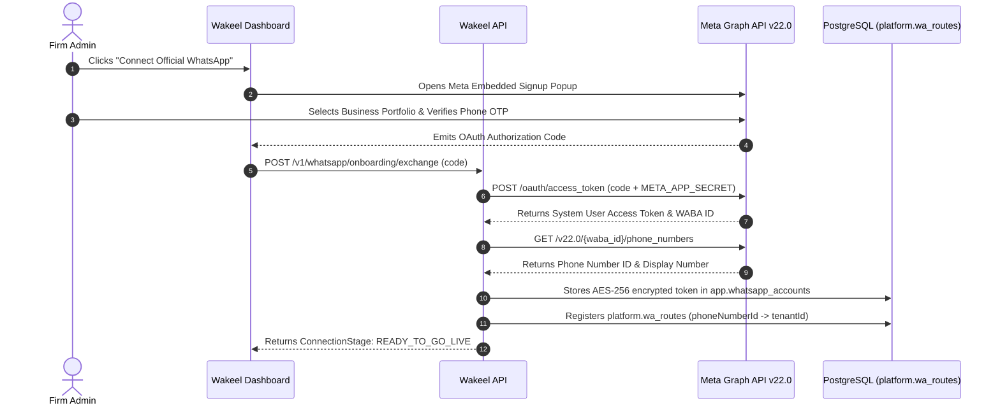

# Meta Cloud API Integration — Official WhatsApp Business Platform

## 1. Architectural Scope & Target Audience

While pilot and budget-conscious law practices utilize Evolution API QR sessions, established Pakistani law firms (particularly Supreme Court advocates, corporate practices, and multi-partner partnerships) require the **Official Meta WhatsApp Cloud API** (Graph API v22.0). 

The Cloud API provides:
- Verified Business Profile (Green badge badge eligibility).
- High-throughput tier limits (1,000 to 100,000+ business-initiated conversations/day).
- Guaranteed uptime backed by Meta SLAs.
- Official Cloud Calling API for WebRTC incoming calls.

---

## 2. Onboarding & Embedded Signup Flow

Wakeel implements Meta's **Embedded Signup** to allow firm administrators to connect their existing Meta Business Manager and phone numbers directly from the dashboard:



---

## 3. The 24-Hour Customer Care Window (ADR-003)

Meta strictly enforces the **24-Hour Customer Care Window**:
1. **Inbound Trigger:** Whenever a client sends a WhatsApp message, a 24-hour window opens. The expiration timestamp is recorded in `app.conversations.sessionWindowExpiresAt`.
2. **Free-Form AI Conversation:** Within this 24-hour window, the AI assistant and human lawyers may send unlimited free-form text, voice notes, and documents.
3. **Outside the Window:** Once `sessionWindowExpiresAt` has passed, Meta's API rejects all standard messages with error code `131047` ("Re-engagement message required"). Proactive outbound communication (hearing reminders, appointment notices) **must use pre-approved templates**.

---

## 4. Message Templates & Pakistan Bar Council Compliance

### 4.1 Strict Exclusion of Marketing Templates
The Pakistan Bar Council Canons of Professional Conduct (Rules 134–144) strictly prohibit advocates from soliciting business or advertising. Consequently, Wakeel's template engine **hardcodes the exclusion of the `MARKETING` category**:
```typescript
// apps/api/src/modules/whatsapp/domain/template.entity.ts
export enum TemplateCategory {
  UTILITY = 'UTILITY',
  AUTHENTICATION = 'AUTHENTICATION',
  SERVICE = 'SERVICE'
  // MARKETING intentionally omitted
}
```

### 4.2 Seeded Template Pack (Bilingual Urdu & English)
Wakeel automatically provisions 3 standardized utility templates in each firm's WABA:

1. **`appointment_confirmation_v1` (UTILITY):**
   - *English:* "Your consultation with Advocate {{1}} is confirmed for {{2}} at {{3}}. Address: {{4}}."
   - *Urdu:* "معزز مؤکل، وکیل {{1}} کے ساتھ آپ کی ملاقات {{2}} بوقت {{3}} طے پا گئی ہے۔"
2. **`hearing_reminder_v1` (UTILITY):**
   - *English:* "Reminder: Case {{1}} hearing is scheduled tomorrow at {{2}} before {{3}}."
   - *Urdu:* "کیس {{1}} کی پیشی کل {{2}} کو عدالت {{3}} میں مقرر ہے۔"
3. **`payment_receipt_v1` (UTILITY):**
   - *English:* "Payment receipt: PKR {{1}} received for {{2}}. Reference: {{3}}."
   - *Urdu:* "آپ کی فیس کی وصولی: رقم {{1}} روپے برائے {{2}} موصول ہو چکی ہے۔"

---

## 5. Webhook Validation & Ingress Security

### 5.1 Verification Challenge (`GET /v1/whatsapp/webhook`)
When registering the webhook in Meta App Dashboard, Meta validates endpoint ownership:
```typescript
@Get('webhook')
verifyWebhook(
  @Query('hub.mode') mode: string,
  @Query('hub.verify_token') token: string,
  @Query('hub.challenge') challenge: string,
) {
  if (mode === 'subscribe' && token === this.config.get('META_WEBHOOK_VERIFY_TOKEN')) {
    return challenge;
  }
  throw new UnauthorizedException();
}
```

### 5.2 Cryptographic Signature Verification (`POST /v1/whatsapp/webhook`)
Every incoming payload carries an `X-Hub-Signature-256` header. The raw request body is verified against `META_APP_SECRET` using HMAC-SHA256 prior to JSON deserialization. Requests failing signature verification are rejected immediately with HTTP 401.
