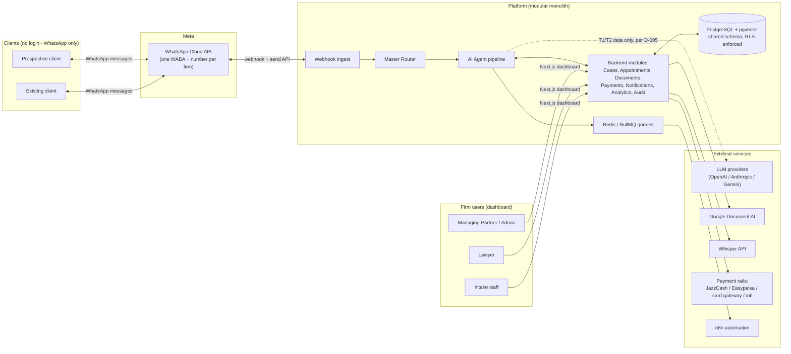
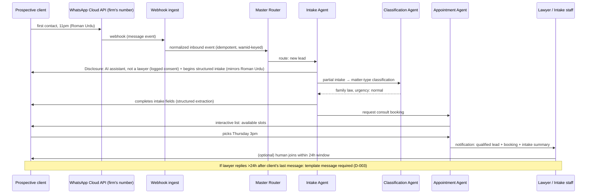
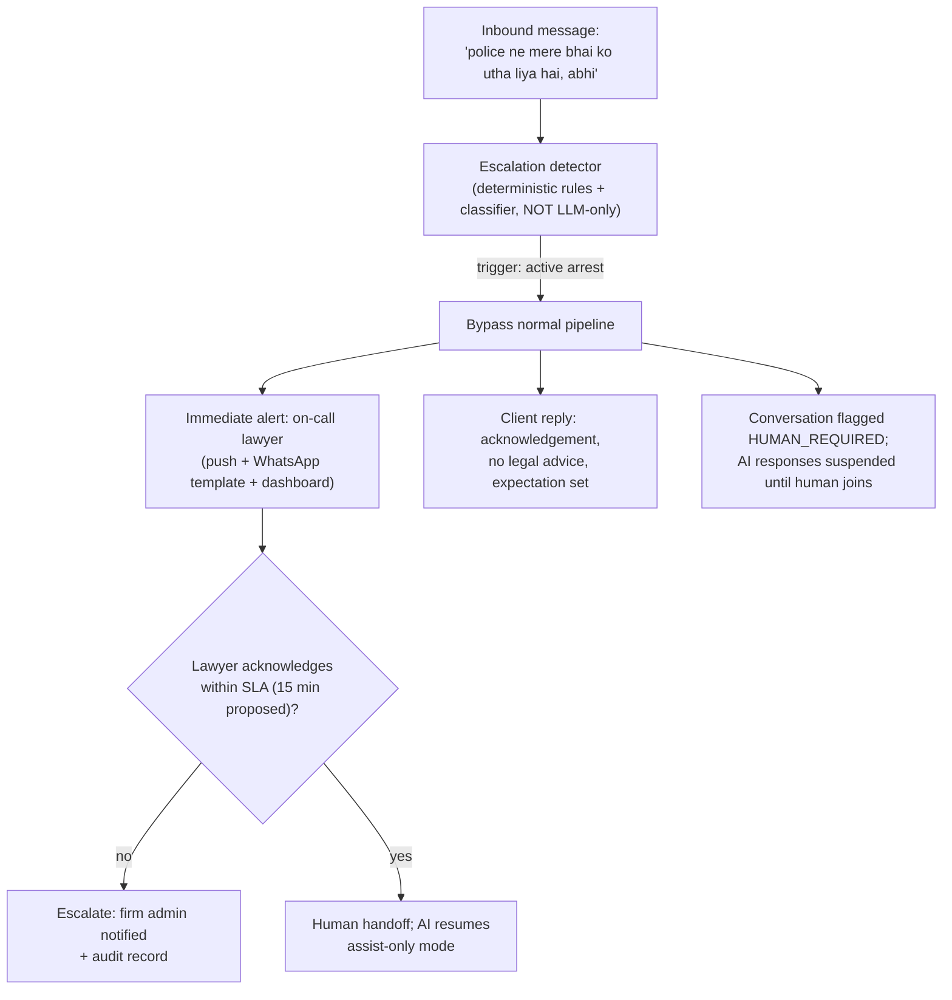

# Phase 1 — Product Requirements

**Status:** Delivered 2026-08-12 — awaiting explicit approval per working agreement
**Project:** Enterprise AI WhatsApp Legal Assistant (multi-tenant SaaS for law firms in Pakistan)

---

## 1. Goal & Definition of Done

**Goal:** Produce a complete, decision-backed requirements baseline for a multi-tenant SaaS that lets Pakistani law firms run client intake, communication, and case coordination over WhatsApp — with AI that assists lawyers and is hard-bounded from giving legal advice.

**This phase is done when:**
- [ ] Personas, user journeys, functional + non-functional requirements exist and are testable
- [ ] The three architecture-shaping decisions (tenancy model, numbering model, language strategy) are made with rejected alternatives documented
- [ ] Scale targets are stated as numbers (proposed, labeled) — "thousands of firms" is quantified
- [ ] Success metrics and guardrail metrics are defined
- [ ] Out-of-scope is explicit
- [ ] Regulatory flags (PECA 2016, PDPB draft, PBC rules) are recorded as flagged-not-solved with an owner
- [ ] Owner approval or change requests issued

---

## 2. Key Decisions & Trade-offs

### D-001 — Tenancy model: shared schema + PostgreSQL Row-Level Security, shard-ready

**Decision:** One database cluster; shared `app` schema for all tenant-owned tables, each carrying `tenant_id`; isolation **enforced at the database layer** via RLS policies with `FORCE ROW LEVEL SECURITY`, a non-owner application role, and a transaction-scoped `SET LOCAL app.tenant_id` applied by the Unit of Work. Cross-tenant/platform tables (tenant registry, platform admins, aggregated analytics) live in a separate `platform` schema. `tenant_id` doubles as the future shard key.

| Alternative | Why rejected |
|---|---|
| Application-level `WHERE tenant_id = ?` filtering only | One missed filter is a cross-tenant breach. Application checks remain as defense-in-depth, never as the enforcement layer. |
| Schema-per-tenant | At thousands of tenants, migrations become O(tenants) fan-out, connection pooling fragments, and Prisma's multi-schema story is weak. Still a single failure domain, so isolation gain is modest. |
| Database-per-tenant | Strongest isolation, worst ops: provisioning in minutes-to-hours, backup matrix ×10,000, connection storms. Correct for <100 enterprise tenants; wrong default for thousands of SMB firms. |
| Multi-cluster by region | Premature — market is Pakistan-centric at launch. |

**Trade-off accepted:** RLS adds per-query overhead and makes "platform-wide" queries awkward (they must use the `platform` schema or a bypass role that is never exposed to request-scoped connections). **Escape hatch preserved:** because `tenant_id` is a first-class column everywhere, a future "dedicated tier" can migrate a large firm to its own database via logical replication without schema changes. Extension point; not built.

### D-002 — WhatsApp identity: one dedicated WABA + phone number per tenant

**Decision:** Each firm gets its own WhatsApp Business Account and display number, onboarded via Meta Embedded Signup with our platform acting as Tech Provider. All templates are submitted and approved per-WABA. Message path is the **official Cloud API directly** — no BSP wrapper (Twilio etc.) in the message path.

| Alternative | Why rejected |
|---|---|
| Shared pooled number with firm-routing (e.g. keyword prefixes) | Breaks the core product promise — clients must feel they're messaging *their* firm. Also: shared quality rating (one firm's spammy behavior throttles or bans everyone), one messaging-limit ceiling across all tenants, and messy per-tenant cost attribution. |
| Per-lawyer numbers | Verification overhead multiplies by headcount; client experience fragments across numbers. |
| BSP-managed numbers (Twilio/360dialog in the message path) | Per-message markup, an extra network hop and failure domain, less control over template approval and Embedded Signup. |

**Trade-off accepted:** onboarding friction. Each firm must pass Meta Business verification, display-name review, and template approval — realistically days, not minutes. Mitigated via guided onboarding wizard and seeded template packs (FR-ONB-*). **Messaging-limit consequence:** a new/unverified WABA starts at ~250 business-initiated conversations/24h and scales through Meta's quality tiers (Meta revises exact tier boundaries periodically — verify the current table at implementation time). Firms needing higher proactive volume must complete verification early; onboarding surfaces this explicitly.

**Open dependency (OQ-2):** procuring clean Pakistani phone numbers per firm — the firm may bring/port its own, or we source them (possibly via a BSP used *only* for number procurement, not messaging).

### D-003 — The 24-hour session window is a first-class scheduling constraint

**Decision:** Conversation state tracks `session_window_expires_at` per conversation. Every proactive module (Reminders, Appointments, Notifications, case updates) checks window state: inside → free-form reply; outside → **pre-approved parameterized template only**. Tenants are seeded with a template pack (appointment reminder, document request, payment reminder, status nudge) in English + Urdu, submitted per WABA at onboarding; firms can customize and resubmit.

| Alternative | Why rejected |
|---|---|
| Treat reminders/nudges as free-form and handle failures | Cloud API rejects out-of-window free-form sends — this would be a designed-in failure, not a fallback. |
| "Keep the window alive" with periodic pings | Violates WhatsApp policy; risks quality rating and the per-tenant number (which is the firm's brand). |
| SMS/email as the primary out-of-window channel | Dilutes the WhatsApp-first product. Noted as a possible later fallback channel; out of scope for v1. |

### D-004 — Language: mirror the client, canonicalize for the firm

**Decision:** Per-message language/script detection (English / Urdu / Roman Urdu, including mixed). Client-facing replies mirror the client's most recent message — language *and* script. Intake extraction normalizes to structured fields (canonical English) while raw original text is always preserved. The lawyer dashboard shows original text with optional translation assist. Templates seeded in EN + UR minimum.

| Alternative | Why rejected |
|---|---|
| English-only intake | Excludes the majority of the target market's clients. Non-starter. |
| Translate everything to English as the pipeline | Adds latency and cost to every message, loses legal nuance (names, Urdu legal terms), and the end users (lawyers) don't need it. Translation becomes an *assist* feature instead. |
| One language lock per conversation | Mixed-language conversations are the norm, not the exception. |

**Accepted risk:** Roman Urdu has measurably weaker classification/extraction accuracy than English or scripted Urdu. Mitigation is a Roman-Urdu evaluation set in the agent test harness (Phase 7/17), not a Phase 1 fix.

### D-005 — AI data posture: tiered data classification governs what leaves our infrastructure

**Decision (requirements-level; enforced architecturally from Phase 2 onward):**

| Tier | Contents | Third-party LLM policy |
|---|---|---|
| **T1 — Safe** | Intents, metadata, aggregates, counts | Any approved provider |
| **T2 — Minimized** | Message text needed for the task, with direct identifiers (names, phone, CNIC numbers) redacted/tokenized where the task permits | Approved providers on enterprise/zero-retention API terms only; per-tenant provider allow-list |
| **T3 — Restricted** | Documents, ID scans, full transcripts, privileged matter details | Never sent to third-party LLMs by default. OCR via Google Document AI under our own cloud terms; LLMs see only task-required, redacted snippets. Zero-retention terms mandatory. |

No client data may be used for provider model training (verify per-provider API terms at contract time). Per-tenant override: a firm can tighten (e.g., "no Anthropic") but never loosen T3.

**Regulatory flags (flagged, not solved — require sign-off by the firm's counsel, and ours):**
- **PECA 2016** — cybercrime/data-handling exposure for intercepted or mishandled communications.
- **Pakistan's draft Personal Data Protection Bill** — not yet enacted as of writing; the design assumes consent logging, purpose limitation, and breach-notification capability so enactment doesn't force a redesign.
- **Pakistan Bar Council conduct rules** — confidentiality obligations on advocates, and restrictions on advertising/solicitation. Direct consequence: **no marketing/broadcast template category in v1** — transactional and service messages only. Automated outreach on behalf of a firm needs counsel review.

### D-006 — Model routing: cost-tiered per agent, explicit fallback chain

**Decision (direction; final selection via evaluation harness in Phase 7):**

| Agent class | Primary | Fallback | Rationale |
|---|---|---|---|
| Master Router / intent / language detection | GPT-4o-mini class | Gemini Flash class | Cheap, fast, high-volume — runs on every inbound message |
| Intake / Conversation / FAQ answer composition | GPT-4o-mini or Claude Haiku (chosen by Urdu/Roman-Urdu eval) | The other | Client-facing quality bar, still cost-conscious |
| Summarization / lawyer-facing drafting | Claude Sonnet class | GPT-4o class | Long-context quality matters; runs per-handoff, not per-message |
| Embeddings (RAG) | OpenAI text-embedding-3 (multilingual) | — | Cross-lingual retrieval EN/UR; dimension decision deferred to Phase 8 |

Every agent has a timeout + circuit breaker + fallback provider. Fallback **never** crosses a tenant's provider allow-list for T2/T3 data.

| Alternative | Why rejected |
|---|---|
| One provider everywhere | Outage blast radius, pricing leverage loss, no per-task cost optimization. |
| Strongest model for everything | At ~1.5M LLM calls/day (proposed scale, §7), cost becomes the largest line item by an order of magnitude. |
| Self-hosted open models (v1) | GPU fleet ops burden. Revisit for T3 workloads if counsel demands in-house inference. |

### D-007 — Voice notes: hosted Whisper behind a port

**Decision:** OpenAI hosted Whisper API v1, accessed through a `SpeechToTextPort` interface so a self-hosted `faster-whisper` adapter can be swapped in per deployment tier. Voice notes are *spoken* Urdu/English (Roman Urdu is a text-script phenomenon and doesn't apply to audio); hosted Whisper's Urdu accuracy is adequate and ~$0.006/min is immaterial at target volumes. Rejected: self-hosted v1 (GPU ops for negligible unit-cost gain); general LLM audio endpoints (locks the transcription path to one vendor).

### D-008 — Payments: multi-rail, including an offline rail

**Decision (requirements-level; provider selection is Phase 13):** A `PaymentPort` abstraction with four rail types: (1) **JazzCash**, (2) **Easypaisa** — the dominant domestic wallet rails; (3) one domestic card/bank gateway (PayFast or Safepay — evaluated in Phase 13); (4) international card processing for firms with overseas clients; plus (5) **manual/offline payment recording with reconciliation** (bank transfer, cash) — a must-have, since a large share of legal fees in Pakistan settle offline.

| Alternative | Why rejected |
|---|---|
| International-only gateway (e.g. Stripe alone) | Incomplete for a Pakistan-based merchant — and concretely, Stripe does not onboard Pakistani merchants directly, so it only serves firms with a foreign entity. |
| Wallets only | Misses card payers and overseas clients. |

### D-009 — Consent, disclosure, and AI boundaries are functional requirements, not copy

**Decision:** The first AI message in any conversation discloses AI-assistant status and the not-legal-advice boundary (logged as a consent artifact). Hard escalation triggers (self-harm, domestic violence, active arrest, imminent court deadline) bypass the agent pipeline and alert a human immediately — implemented as deterministic classifier + rules, **not** left to LLM judgment. No definitive legal conclusions, ever; FAQ answers are sourced only from the tenant's own knowledge base with citations.

---

## 3. Architecture (product context, Phase 1 level)

Folder/module, data model, and API diagrams intentionally deferred (see §11). System-in-context view:

---

## 4. Personas

| # | Persona | Context | Goals | Pains today |
|---|---|---|---|---|
| P1 | **Managing Partner / Firm Admin** — e.g. Sana, 45, runs an 8-lawyer firm in Lahore | Decision-maker, billing owner, non-technical but spreadsheet-literate | More retained clients, visibility into intake, no ethical/compliance surprises | Leads lost after hours; no idea which lawyer replied to whom; fee follow-ups are manual |
| P2 | **Associate Lawyer** — e.g. Bilal, 29, 30+ active matters | Already lives in personal WhatsApp; mixes work/family chats | Fast case context, fewer repetitive client updates, clean handoffs | Scrolls hundreds of messages to reconstruct context; misses court-date nudges |
| P3 | **Intake Coordinator / front desk** — e.g. Ayesha | First human touchpoint; Urdu-dominant, working English | A queue of pre-qualified, structured leads; easy appointment booking | Phone tag; re-typing caller details into registers/Excel |
| P4 | **Prospective client (lead)** — e.g. Imran, Roman-Urdu texter, messaging at 11pm about a custody dispute | WhatsApp-only; anxious; will not install an app or fill a web form | Immediate acknowledgement, to be understood in his own words, a booked consult | Firms don't reply after hours; doesn't know what info to provide |
| P5 | **Existing client** — e.g. Farzana, Urdu-only, sends voice notes and document photos | Low digital literacy; case already engaged | Case status without calling; knows her documents reached the lawyer | Calls go unanswered; no confirmation anything was received |
| P6 | **Platform Super-Admin (us)** | Operates the SaaS | Tenant health, abuse detection, cost control | — (operational persona) |

Deliberate split: **firm users get the dashboard; clients get WhatsApp only.** No client-side app or portal in v1.

---

## 5. User Journeys

### J1 — Lead intake to booked consultation (primary revenue journey)

### J2 — Hard escalation (active arrest)

### J3 — Existing client asks for case status
Client asks (any language) → router identifies existing client + active matter → agent answers from case status fields + firm KB (no conclusions, citations where KB used) → if question needs judgment ("will I win?"), agent declines + notifies assigned lawyer → summary appended to case timeline.

### J4 — Document submission
Client sends a photo (CNIC, FIR, notice) → media fetched → Document Agent: OCR (Google Document AI), type classification, PII tagging → stored in tenant-scoped storage, attached to case, virus-scanned → lawyer notified with extracted summary → client receives confirmation. **Known risk:** printed Urdu/CNIC OCR is workable; *handwritten* Urdu OCR is unreliable — flagged for Phase 11 evaluation, never silently trusted (extraction confidence surfaced to lawyer).

### J5 — Appointment lifecycle across the 24h window
Booking confirmed (in-window, free-form) → 24h before appointment: **client's window has expired → approved reminder template** sent → client replies "confirm" (reopens window) → free-form follow-ups → no-show or reschedule handled by Appointment Agent → lawyer calendar updated.

### J6 — Fee payment
Lawyer (or n8n workflow) issues payment request → client receives template with amount + reference → pays via JazzCash/Easypaisa/card link → webhook reconciles → receipt via WhatsApp → case ledger updated. Offline payment (cash/bank transfer) recorded manually by staff, marked reconciled.

### J7 — Tenant onboarding (the journey that decides growth)
Signup (Clerk) → firm profile → **Meta Embedded Signup → Business verification → WABA + number provisioning** → seeded template pack submitted (EN+UR) → lawyer/staff invited → knowledge base seeded → **"send your first message" test** → live. Target: median time-to-first-live-message ≤ 7 days (proposed). Highest drop-off risk (Meta verification); gets a dedicated funnel dashboard.

---

## 6. Functional Requirements

Priority: **P0** = launch blocker, **P1** = fast-follow (≤ 90 days post-launch), **P2** = later. Every P0 requirement is written to be directly testable.

### Tenant Onboarding & Administration (FR-ONB)
| ID | Requirement | Pri |
|---|---|---|
| FR-ONB-01 | Firm self-service signup with firm profile (name, practice areas, city, bar registrations) | P0 |
| FR-ONB-02 | Guided Meta Embedded Signup flow; WABA + phone number bound to tenant; verification status tracked (pending/verified/rejected with reasons) | P0 |
| FR-ONB-03 | Seeded WhatsApp template pack (appointment reminder, doc request, payment reminder, status nudge) in EN + UR, submitted per-WABA; approval status tracked | P0 |
| FR-ONB-04 | Invite/manage users with roles: Firm Admin, Lawyer, Staff, Read-only (see §10 RBAC) | P0 |
| FR-ONB-05 | Firm settings: working hours, consultation fee, practice-area toggles, escalation contact chain, AI provider allow-list (tighten-only, per D-005) | P0 |
| FR-ONB-06 | Onboarding checklist UI with time-to-first-message funnel tracking | P1 |
| FR-ONB-07 | Firm-initiated data export (all cases, messages, documents) in portable format | P0 (regulatory hygiene) |
| FR-ONB-08 | Tenant suspension/offboarding flow: number release, 90-day export window, then hard delete | P1 |

### WhatsApp Messaging (FR-MSG)
| ID | Requirement | Pri |
|---|---|---|
| FR-MSG-01 | Webhook verification + ingestion for messages, statuses, template events; idempotent on Meta message ID (`wamid`); exactly-once semantics via dedupe store | P0 |
| FR-MSG-02 | Send text, interactive buttons/lists, templates, media (image/PDF/audio); per-tenant credentials; send failures retried with exponential backoff, dead-lettered after N attempts | P0 |
| FR-MSG-03 | Session-window tracking per conversation (`session_window_expires_at`); out-of-window sends automatically require template selection — free-form send is blocked, not failed | P0 |
| FR-MSG-04 | Media download/upload incl. voice notes; voice notes auto-transcribed (Whisper) with transcript attached, original retained | P0 |
| FR-MSG-05 | Per-message language/script detection (EN/UR/Roman-Urdu/mixed); replies mirror the client's latest message | P0 |
| FR-MSG-06 | Delivery/read receipts surfaced in the inbox UI | P0 |
| FR-MSG-07 | Per-tenant outbound rate limiting + queueing, so one firm's burst cannot degrade others (noisy-neighbor protection at platform level, separate from Meta's per-number limits) | P0 |
| FR-MSG-08 | Location-message capture stored as structured field | P1 |

### AI Agents (FR-AI)
| ID | Requirement | Pri |
|---|---|---|
| FR-AI-01 | First AI message in every conversation discloses AI-assistant status + not-legal-advice boundary, in the client's language; disclosure event logged (consent artifact) | P0 |
| FR-AI-02 | Master Router classifies every inbound message (intent, language, urgency, existing vs. new client) and routes to an agent; routing decision logged with model, latency, cost | P0 |
| FR-AI-03 | Intake Agent conducts structured, multi-turn intake (contact details, matter description, opposing party, key dates, jurisdiction/city) with field-level extraction and confirmation prompts | P0 |
| FR-AI-04 | Classification Agent assigns matter type from the firm's enabled practice areas + confidence; low confidence → human triage queue, never a guessed classification presented as fact | P0 |
| FR-AI-05 | Hard escalation triggers (self-harm, domestic violence, active arrest, imminent court deadline ≤48h) detected by deterministic rules + classifier; on trigger: pipeline bypass, immediate human alert, AI client-responses suspended (J2). Requirement: **100% recall on the red-team escalation set** — a missed active-arrest escalation is a launch-blocking defect | P0 |
| FR-AI-06 | Agents never produce definitive legal conclusions or outcome predictions; refusal pattern redirects to lawyer. Verified by red-team suite before launch and sampled in production | P0 |
| FR-AI-07 | FAQ Agent answers only from the tenant's own knowledge base, with source citation stored on the message; no KB coverage → graceful decline + lawyer notification | P0 |
| FR-AI-08 | Summarization Agent produces structured handoff summaries (parties, matter type, facts, asks, deadlines, documents received, open items) on handoff, on lawyer request, and daily-digest | P0 |
| FR-AI-09 | Human handoff: lawyer joins any conversation; AI switches to assist-only (draft suggestions) until released; full transcript preserved | P0 |
| FR-AI-10 | Every LLM call logged: agent, model, prompt version, token counts, latency, cost, tenant, data-tier (T1/T2/T3), redaction applied (Prompt Logs / AI Logs) | P0 |
| FR-AI-11 | Per-tenant monthly AI cost budget with soft alert + hard cap; cap behavior = degrade to human queue, never silent failure | P0 |
| FR-AI-12 | Model fallback chain per agent (D-006) with circuit breaker; fallback events logged and alerted | P1 |

### Cases (FR-CSE)
| ID | Requirement | Pri |
|---|---|---|
| FR-CSE-01 | Case entity: parties, matter type, status, assigned lawyer(s), intake data, timeline (messages, documents, appointments, payments, notes), custom reference number per firm | P0 |
| FR-CSE-02 | Lead → case conversion with dedupe (same client + same matter type merges rather than duplicates) | P0 |
| FR-CSE-03 | Lawyer assignment rules (practice-area match, round-robin, manual) | P0 |
| FR-CSE-04 | Case status workflow configurable per practice area (e.g. consultation → engaged → in-court → closed) | P1 |
| FR-CSE-05 | Full-case export (PDF bundle + JSON) for the firm | P1 |

### Appointments (FR-APT)
| ID | Requirement | Pri |
|---|---|---|
| FR-APT-01 | Per-lawyer availability, working hours, consultation duration; booking via WhatsApp interactive list and dashboard calendar | P0 |
| FR-APT-02 | Automated reminders at configurable offsets, sent as approved templates when outside the session window (D-003); confirm/reschedule/cancel via button replies | P0 |
| FR-APT-03 | No-show handling: mark, notify lawyer, offer rebooking to client | P1 |
| FR-APT-04 | Double-booking prevention at DB level (exclusion constraint), not just app checks | P0 |
| FR-APT-05 | Calendar sync (Google Calendar) for lawyers | P1 |

### Documents (FR-DOC)
| ID | Requirement | Pri |
|---|---|---|
| FR-DOC-01 | Tenant-scoped document storage (Supabase Storage as object store only) with per-tenant path isolation + signed URLs, short TTL | P0 |
| FR-DOC-02 | OCR (Google Document AI) + document-type classification + extraction-confidence surfaced in UI; low confidence never auto-applied | P0 |
| FR-DOC-03 | Malware scanning on all uploads before lawyer access | P0 |
| FR-DOC-04 | Documents linked to case + message provenance (which client sent it, when, via which message) | P0 |
| FR-DOC-05 | Document request workflow: agent requests specific docs via template; received docs auto-matched to the request | P1 |
| FR-DOC-06 | Versioning and soft-delete with audit trail | P1 |

### Payments (FR-PAY)
| ID | Requirement | Pri |
|---|---|---|
| FR-PAY-01 | Payment request creation (amount, description, case ref) sent via template with pay-by link | P0 |
| FR-PAY-02 | JazzCash + Easypaisa rails via PaymentPort; webhook reconciliation; idempotent on provider transaction ID | P0 |
| FR-PAY-03 | Manual/offline payment recording (cash, bank transfer) with staff attribution + reconciliation status | P0 |
| FR-PAY-04 | Receipt via WhatsApp; per-case and per-firm ledger views | P0 |
| FR-PAY-05 | One domestic card/bank gateway (PayFast or Safepay, selected in Phase 13) | P1 |
| FR-PAY-06 | International rail for overseas clients (provider per Phase 13 evaluation; constraint: no direct PK Stripe onboarding) | P1 |
| FR-PAY-07 | Refund workflow with approval step | P2 |

### Notifications & Reminders (FR-NTF)
| ID | Requirement | Pri |
|---|---|---|
| FR-NTF-01 | Lawyer notifications: dashboard + web push for escalations, new qualified leads, documents received, payments; escalation alerts additionally via WhatsApp template to the lawyer's number | P0 |
| FR-NTF-02 | Escalation SLA timer (15 min proposed): unacknowledged escalation auto-escalates to Firm Admin; all transitions audited | P0 |
| FR-NTF-03 | Client nudges (stale intake, pending doc request) via template, frequency-capped per firm policy | P1 |
| FR-NTF-04 | Daily digest to each lawyer: today's appointments, overnight intake summaries, pending items | P1 |

### Knowledge Base / RAG (FR-KB)
| ID | Requirement | Pri |
|---|---|---|
| FR-KB-01 | Firm-managed KB: articles/FAQs/documents, EN + UR, draft/published states | P0 |
| FR-KB-02 | Ingestion pipeline: chunking, embedding, pgvector index, **scoped per tenant — retrieval filters on tenant_id at the query layer AND is RLS-enforced**; zero cross-tenant retrieval is a hard guardrail | P0 |
| FR-KB-03 | FAQ answers cite KB source; citation stored on the message | P0 |
| FR-KB-04 | KB analytics: unanswered-question report (coverage gaps) per firm | P1 |

### Analytics (FR-ANA)
| ID | Requirement | Pri |
|---|---|---|
| FR-ANA-01 | Firm dashboard: leads, conversion (lead→consult→engaged), response times, AI containment rate, appointment show rate, revenue collected | P0 |
| FR-ANA-02 | Platform dashboard: tenant health, message volumes, template approval/rejection rates, AI cost per tenant, error rates | P0 |
| FR-ANA-03 | Onboarding funnel (J7 steps) with drop-off | P1 |

### Audit & Access (FR-AUD)
| ID | Requirement | Pri |
|---|---|---|
| FR-AUD-01 | Immutable audit log for every privileged action: case access, document view/download, payment actions, settings changes, handoffs, exports — who/what/when/tenant | P0 |
| FR-AUD-02 | RBAC enforcement server-side on every endpoint (roles per FR-ONB-04) | P0 |
| FR-AUD-03 | Platform-admin access into any tenant is role-gated, reason-tagged, and itself audited (break-glass pattern) | P0 |

---

## 7. Non-Functional Requirements

**Scale targets — ALL PROPOSED (OQ-1), confirm or override:**

| Parameter | Proposed value | Basis |
|---|---|---|
| Design ceiling | 10,000 tenants | "Thousands of firms" requirement |
| Year-1 target | 2,000 active tenants | GTM assumption |
| Avg firm profile | 5 lawyers, 40 client conversations/day | SMB PK firm estimate |
| Messages/day @ 2k tenants | ~640k (80k conv × 8 msgs) | ≈7.4 msg/s avg |
| Peak throughput | 100 msg/s sustained, 250 msg/s burst (platform-wide) | 10–15× avg peak factor; Meta per-number default is 80 msg/s, so Meta is not the platform bottleneck |
| Concurrent active conversations | ~8,000 peak | Peak-hour overlap |
| LLM calls | ~1.5M/day (~17/s avg, ~150/s peak) | ~2 calls per inbound message + async jobs; drives provider rate-limit tiering + queue smoothing |
| Blended AI cost guardrail | ≤ $0.005 per inbound message (≈ ≤ $65/tenant/mo at 40 conv/day) | D-006 routing; enforced by FR-AI-11 |

**NFR table:**

| ID | Category | Requirement & target (proposed) | Verified by |
|---|---|---|---|
| NFR-PERF-01 | Latency | Webhook ingest ack p95 < 500 ms (async processing after ack) | Load test + APM |
| NFR-PERF-02 | Latency | AI reply, webhook-received → send-API-called, p95 < 12 s (in-window) | APM, per-agent spans |
| NFR-PERF-03 | Latency | Dashboard server response p95 < 300 ms | APM |
| NFR-SCALE-01 | Scalability | Horizontal scale of ingest + worker tiers to 250 msg/s without data loss (queue-backed) | Load test (Phase 18) |
| NFR-AVAIL-01 | Availability | 99.9% monthly (≤ ~44 min downtime); graceful degradation: LLM outage → human-queue mode, WhatsApp outage → retry with backoff, never drop messages | GameDay + SLA report |
| NFR-DR-01 | Disaster recovery | RPO ≤ 5 min (WAL archiving / PITR), RTO ≤ 60 min, documented runbook, **restore drill executed in Phase 18** | DR drill |
| NFR-SEC-01 | Isolation | Tenant isolation enforced by RLS at DB layer (D-001); automated test suite attempts cross-tenant access as a non-owner role and must get zero rows | Security test suite, CI-gated |
| NFR-SEC-02 | Encryption | TLS 1.2+ in transit; AES-256 at rest (DB, storage, backups); secrets in env/secret manager, validated at boot, never in repo | Config audit |
| NFR-SEC-03 | Rate limiting | Per-IP, per-user, and **per-tenant** limits; webhook endpoint signature-verified (Meta app secret) | Pen test |
| NFR-SEC-04 | Compliance | OWASP Top 10 audit clean at Phase 18; dependency scanning in CI | Audit |
| NFR-A11Y-01 | Accessibility | Dashboard WCAG 2.1 AA; Urdu content renders correctly RTL inside an LTR app shell | a11y test suite + manual audit |
| NFR-I18N-01 | i18n | Correct storage/rendering of Urdu (Nastaliq) and mixed-script text end-to-end; dashboard chrome English in v1 | E2E tests |
| NFR-OBS-01 | Observability | Correlation ID threaded webhook → agent → DB → send; structured logs; metrics on every external call (LLM latency/cost, WhatsApp errors, queue depth) | Phase 16 acceptance |
| NFR-RET-01 | Retention (provisional, counsel to confirm) | Tenant data retained for tenant lifetime + 90-day export window post-termination; platform audit logs 7 years; per-tenant stricter overrides configurable | Policy test |

---

## 8. Success Metrics

**Product metrics (launch + 90 days):**
- Tenant activation: median time-to-first-live-WhatsApp-message ≤ 7 days; ≥ 50% of signups reach it (J7)
- Intake completion rate ≥ 60% of started intakes
- AI intake containment ≥ 70% (resolved without human touch) **with** client CSAT ≥ 4/5 — containment without the satisfaction guardrail is a vanity metric
- Median first response to a new lead < 1 minute, 24/7 (vs. hours baseline)
- Lawyer time saved ≥ 5 h/week (survey + measured handoff-summary adoption)
- Template approval rate ≥ 90%; per-tenant messaging-limit tier progression tracked

**Business metrics:** tenant MRR, logo churn < 3%/mo, AI cost per tenant within guardrail (§7).

**Hard guardrails (any violation = incident, not a metric dip):**
- Zero cross-tenant data exposure (any layer)
- 100% recall on hard-escalation triggers (FR-AI-05)
- Zero confirmed AI-legal-conclusion incidents (red-team + production sampling)

---

## 9. Explicitly Out of Scope (v1)

1. AI legal advice, opinions, outcome predictions, or document drafting *for clients* (lawyer-facing drafting assist is a later, separately-reviewed feature)
2. Court e-filing / integration with court systems
3. Client-facing web portal or mobile app — the client surface is WhatsApp only
4. Native mobile apps for lawyers (responsive web dashboard instead)
5. SMS, IVR, email as channels (may become fallback channels later)
6. Marketing/broadcast campaigns (PBC solicitation risk, D-005)
7. In-app video consultations
8. Full accounting/GL (ledgers here are per-case fee records, not books of account)
9. Self-hosted LLM inference (revisit for T3 if counsel requires)
10. Urdu-localized dashboard chrome (RTL *content* rendering is in scope; translated UI is not)
11. E-signatures

---

## 10. Security & Regulatory Considerations (Phase 1 scope)

- **Data classification (D-005 tiers)** is a standing requirement referenced by every later phase; each integration declares the highest tier it touches.
- **Consent & disclosure:** FR-AI-01 disclosure is logged; WhatsApp opt-in is established by the client messaging the firm's number first (no cold outreach in v1 — aligns with both Meta policy and PBC solicitation constraints).
- **RBAC baseline:** Platform SuperAdmin (us); Firm Admin; Lawyer; Staff; Read-only. Full permission matrix in Phase 10.
- **Regulatory register (flagged, not solved — owners needed):**

| Flag | Concern | Design accommodation already made | Needed |
|---|---|---|---|
| PECA 2016 | Data handling, unauthorized access liability | Encryption, audit logs, access control | Counsel review of data-handling SOPs |
| Draft PDPB | Future consent/breach-notification duties | Consent artifacts, per-tenant retention config, export tooling | Track enactment; gap analysis then |
| PBC conduct rules | Confidentiality; solicitation/advertising restrictions | No marketing templates; AI never advises; firm owns its KB content | **Each firm's counsel signs off on automated client communication** |
| Bar Council confidentiality | Privileged data to third-party LLMs | D-005 tiering, zero-retention terms, per-tenant allow-list | Provider DPA review |

---

## 11. Sections Skipped for This Phase (per working agreement)

- **Folder/Module Structure** — no code in Phase 1; arrives in Phase 4 (backend) and Phase 5 (frontend).
- **Data Model** — Phase 3 owns the full schema; Phase 1 only fixes the *isolation strategy* (D-001), a requirement-level decision.
- **API/Contract Design** — begins Phase 4; nothing to contract yet.
- **Code** — requirements phase.
- **Testing Strategy** — Phase 17 owns it; Phase 1 contributes the acceptance criteria embedded in FRs and the two CI-gated suites already committed: cross-tenant RLS tests (NFR-SEC-01) and the escalation red-team set (FR-AI-05).

---

## 12. Open Questions, Risks & Assumptions

**Open questions (defaults in brackets — override anything):**
1. **Scale numbers** (§7): confirm 10k ceiling / 2k year-1 / 40 conv per firm-day, or supply figures. [Proceed with proposed]
2. **Number procurement:** do firms bring/port their own numbers, or must we source Pakistani numbers per tenant? If we source, a BSP used *only* for number procurement may be necessary — acceptable deviation from D-002's no-BSP stance? [Support both paths; bring-your-own first]
3. **Sandbox/trial deviation:** permit a shared, clearly-branded trial number for evaluation before a firm's WABA is verified? Deviates from D-002. [No trial number in v1; trial uses the firm's verified WABA, onboarding funnel optimized instead]
4. **Payments:** confirm JazzCash + Easypaisa + one card gateway + offline recording covers market expectation; any firms needing international rails at launch? [As D-008]
5. **Retention periods** (NFR-RET-01) — to be validated by counsel; confirm who provides that sign-off and by when.
6. **Dashboard language:** English chrome with full Urdu content rendering — acceptable to target firms? [Yes per D-004]
7. **Meta program path:** register as Tech Provider and complete Meta App Review — is there an existing Meta Business entity/partner status, or is that on the critical path? [Assume greenfield; timeline risk R1]

**Risks (ranked):**
- **R1 — Meta verification friction** stalls tenant onboarding (J7 is the growth funnel). Mitigation: guided flow, verification-status tracking, onboarding checklist; measured by FR-ANA-03.
- **R2 — PBC solicitation interpretation** restricts even transactional automation. Mitigation: counsel sign-off gate; no marketing category; disclosure-first design.
- **R3 — Roman Urdu NLP quality** degrades intake/classification. Mitigation: eval set, human-triage fallback (FR-AI-04).
- **R4 — Handwritten Urdu OCR** unreliable (J4). Mitigation: confidence surfacing; never auto-apply low-confidence extraction.
- **R5 — WhatsApp pricing/policy shifts** (Meta moved template billing to per-message pricing in mid-2025; further changes possible). Mitigation: cost guardrails, rate-card verified at Phase 6, per-tenant cost dashboards.
- **R6 — LLM provider data terms drift.** Mitigation: D-005 tiering + contract review cadence + per-tenant allow-list.
- **R7 — AI cost blowout per tenant.** Mitigation: FR-AI-11 budgets with human-queue degradation.

**Assumptions:**
- Target firms are registered businesses able to pass Meta Business verification.
- Lawyers/staff have a computer or modern smartphone for the dashboard; clients overwhelmingly have WhatsApp (near-universal in PK).
- Firm users read English UI; clients do not need to.
- One firm's message volume will not exceed Meta's per-number throughput (80 msg/s default); a whale tenant can use Meta's per-number upgrade path.

---

## 13. Decision Log

See [../decision-log.md](../decision-log.md) for the running log. Decisions D-001 through D-012 originate in this phase.
