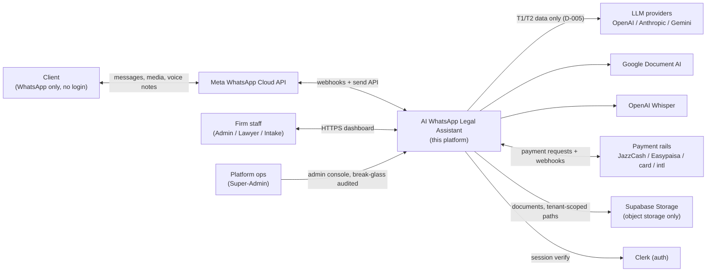
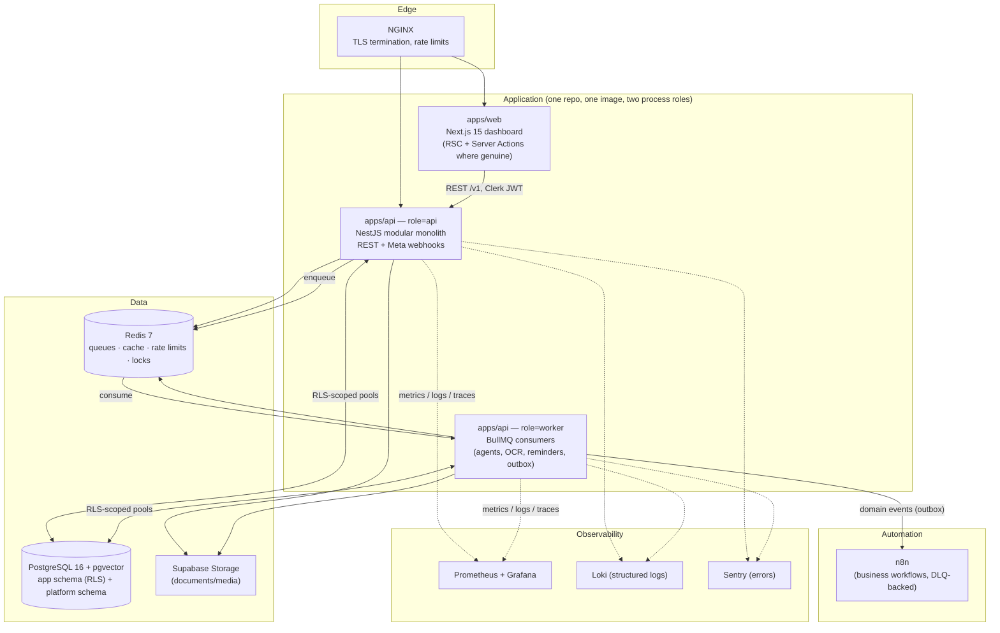

# Phase 2 — System Architecture

**Status:** Delivered 2026-08-12 · builds on Phase 1 (approved-by-direction: "start build phase by phase")
**Scope:** C4-style diagrams, module boundaries, ADRs for the major calls. No schema (Phase 3), no API contracts (Phase 4), no code beyond what diagrams imply.

---

## 1. Goal & Definition of Done

**Goal:** Fix the structural decisions every later phase builds on: container layout, module boundaries and their communication rules, tenancy enforcement mechanics, and the sync/async split.

**Done when:**
- [x] C4 context + container diagrams render and match Phase 1 decisions
- [x] Every backend module has a stated responsibility, public interface, and forbidden interactions
- [x] ADRs recorded for: modular monolith vs microservices, tenancy enforcement, outbox/eventing, CQRS placement, process topology, correlation
- [x] Each ADR names rejected alternatives

---

## 2. C4 — Level 1: System Context

## 3. C4 — Level 2: Containers

**Why one image with two roles (`role=api | role=worker`) instead of separate services:** the worker consumes the same domain code (agents, repositories) — duplicating it into a second package guarantees drift; deploying the same artifact with a role flag keeps one build, one type surface, one dependency tree. Rejected: separate worker repo (code drift), serverless functions per job (cold starts hurt the 12s p95 AI-reply budget; webhook ingest needs always-on sockets).

---

## 4. Backend Module Boundaries (the load-bearing rule set)

14 modules, each internally layered **domain → application → infrastructure → interface** (hexagonal). The domain layer imports **nothing** from NestJS, Prisma, or vendor SDKs — only `packages/shared` value objects.

| Module | Owns (tables) | Publishes (events) | Consumes |
|---|---|---|---|
| Auth | (Clerk-backed; local role cache) | `user.role.changed` | — |
| Users | `users`, `roles`, `permissions`, `role_permissions` | `user.invited` | Auth |
| Lawyers | `lawyers`, `lawyer_availability` | `lawyer.availability.changed` | Users |
| Cases | `clients`, `cases`, `case_lawyers` | `case.created/assigned/status.changed` | Users, Lawyers |
| Messages | `conversations`, `messages`, `intake_sessions` | `message.inbound.received`, `conversation.handoff.*` | WhatsApp, Cases |
| WhatsApp | `whatsapp_accounts`, `whatsapp_templates`, `webhook_events` | `whatsapp.message.status` | (none — leaf adapter) |
| AI | `ai_logs`, `prompt_versions`, `prompt_logs`, `escalations` | `ai.escalation.triggered`, `ai.intake.completed` | Messages, RAG, Cases |
| RAG | `knowledge_base`, `kb_chunks` | `kb.indexed` | (Documents for source files) |
| Documents | `documents`, `document_requests` | `document.received/processed` | Messages, Cases |
| Appointments | `appointments` | `appointment.booked/confirmed/cancelled` | Lawyers, Cases |
| Payments | `payments` | `payment.requested/succeeded/failed` | Cases |
| Notifications | `notifications` | (leaf) | all event publishers |
| Analytics | read models (`analytics_*`, platform schema aggregates) | (leaf) | all events |
| Audit | `audit_logs` | (leaf, append-only) | all modules via interceptor |

**Communication rules (enforced by lint + review):**
1. Cross-module calls go through the target module's **application service interface** (a port exported from its index), never its repositories/entities.
2. Cross-module *data needs* after the fact go through **domain events** on the outbox — a module never reaches into another module's tables. (Analytics' read models are fed by events, not by querying operational tables.)
3. Sync in-process calls for request-scoped queries/commands; async events for anything that can lag (notifications, analytics, indexing, n8n).
4. **CQRS is used in exactly two places** and justified: (a) the **inbox read path** — a denormalized `inbox_view` (conversation + last message + unread + state) because the inbox is the hottest firm-facing query and joins across 4 tables at 8k concurrent conversations is wasted work; (b) **analytics read models** — event-projected aggregates, because reporting must not scan operational/RLS-partitioned tables. Everywhere else: plain repositories. Rejected: uniform CQRS/event-sourcing (complexity without payoff at this scale).

---

## 5. ADRs

### ADR-001 — Modular monolith, extractable later
**Decision:** One NestJS application with hard module boundaries (§4), deployed as `api` + `worker` roles.
**Rejected:** Microservices v1 — 14 services × infra each is unstaffed at this stage, distributed transactions across WhatsApp/AI/DB would eat the latency budget, and boundaries aren't yet load-tested by reality. Monolith-first with interface/event discipline keeps the extraction option open (each module already talks via ports/events, so peeling off AI or WhatsApp later is mechanical).
**Cost accepted:** one deploy unit — a bad deploy can take down all modules; mitigated by role separation and queue draining on shutdown.

### ADR-002 — Tenancy enforcement: RLS + transaction-scoped context
**Decision:** Implements D-001. Mechanics: app connects as role `app_user` (non-owner, `NOBYPASSRLS`); every tenant-owned table has `ENABLE` + `FORCE ROW LEVEL SECURITY` with policy `tenant_id = current_setting('app.tenant_id')::uuid`; the Unit of Work runs `SET LOCAL app.tenant_id = $1` inside each transaction, sourced from a request-scoped `TenantContext` (AsyncLocalStorage) populated from the Clerk JWT's `tenant_id` claim (or webhook routing for inbound WhatsApp). Migrations run as the owner role (RLS bypasses owner — hence `FORCE`).
**Rejected:** (a) app-level filters only — one missed `WHERE` = breach; (b) a database user per tenant — pool explosion; (c) Prisma client extensions injecting filters — still app-layer, same failure mode as (a), kept only as defense-in-depth.
**Cost accepted:** every query needs the GUC set → all writes go through the UnitOfWork; raw queries outside it are a lint error. Cross-tenant platform queries use the `platform` schema + a separate `platform_user` role, never reachable from request-scoped code paths.

### ADR-003 — Reliable eventing: transactional outbox on Postgres, dispatcher to BullMQ; no Kafka
**Decision:** State change + event row commit in the same DB transaction (`outbox_events`); a worker-side dispatcher reads unpublished rows and enqueues to BullMQ; consumers are idempotent (event-id dedupe). n8n receives events via signed webhooks from a dedicated relay consumer, with DLQ.
**Rejected:** Kafka/RabbitMQ — operationally heavy for ~1.5M events/day and one more stateful system to back up; in-process `EventEmitter` — events die with the process and can't be replayed, unacceptable for notifications/payments; dual-write without outbox — classic lost-event bug (DB commits, queue publish fails).
**Cost accepted:** dispatcher poll latency (~1s) — fine for notifications/analytics; anything latency-critical stays synchronous.

### ADR-004 — Inbound pipeline: ack fast, process async, idempotent everywhere
**Decision:** Meta webhook → verify signature → persist raw `webhook_events` row (unique on Meta event id) → 200 OK (<500 ms, NFR-PERF-01) → BullMQ job normalizes → routes. Meta retries aggressively on non-200s and duplicates are normal, so idempotency keys (`wamid`, event id) are enforced at the DB unique-constraint level, not in code alone.
**Rejected:** synchronous processing in the webhook request (p95 blows past ack budget, Meta disables flaky webhooks); dedupe in Redis only (cache eviction = duplicate processing).
**Cost accepted:** at-least-once delivery semantics everywhere downstream — every consumer must be idempotent; this is stated as a standing rule for Phases 6/7/9.

### ADR-005 — Correlation & observability spine
**Decision:** Every inbound request/webhook gets a `correlation_id` (UUID) in AsyncLocalStorage, propagated into BullMQ job payloads, LLM calls, and n8n webhook headers; pino structured logs include `correlation_id`, `tenant_id`, `agent`, `model`; Prometheus metrics on every external call (name, latency, error, cost for LLMs). OpenTelemetry SDK from day one, exporter swappable.
**Rejected:** bolt-on tracing later (retrofitting context propagation through queues is the expensive way); DataDog/NewRelic SaaS (cost + data-residency for a legal product — self-hosted LGTM stack instead).
**Cost accepted:** OTel adds ~ms overhead; worth it for the webhook→agent→DB story the brief demands.

### ADR-006 — AuthN/Z: Clerk sessions, backend-verified; RBAC resolved locally
**Decision:** Frontend uses Clerk; API verifies Clerk JWTs via Clerk's backend SDK (JWKS, cached); authorization is local: JWT carries `tenant_id` + role, checked against the `roles`/`permissions` tables by a global guard. Platform Super-Admin is a separate Clerk organization + break-glass audit (FR-AUD-03).
**Rejected:** NextAuth/Auth.js self-rolled (we'd own MFA, session rotation, org management — undifferentiated heavy lifting); storing passwords ourselves (non-starter for a legal product); permissions embedded in JWT without local check (stale-permission problem on role change — local table lookup per request, cached 60s, wins).
**Cost accepted:** Clerk is a US processor — flagged in the regulatory register alongside LLM providers; firm staff data (not client-privileged data) is what Clerk holds.

---

## 6. Security Considerations (phase-specific)

- The RLS mechanism in ADR-002 is the primary isolation control; NFR-SEC-01's cross-tenant test suite becomes a CI gate from Phase 3 onward.
- `webhook_events` stores raw payloads (may contain T2/T3) — access restricted to the WhatsApp module; retention-trimmed after processing (payload nulled, metadata kept) — detailed in Phase 6.
- Outbox payloads are classified by data tier (D-005); n8n receives T1/T2 only — n8n is automation infrastructure, not a privileged-data store.
- Break-glass platform access is a distinct code path (separate role, reason-tag mandatory) — designed now so it isn't retrofit.

## 7. Sections Skipped

- **Data Model / API / Code:** Phases 3–4 (immediately following in this build session).
- **Folder structure:** first appears with code in Phase 4.
- **Testing strategy:** Phase 17; Phase 2 contributes the standing rule "every consumer idempotent" (ADR-004) and the RLS CI gate.

## 8. Open Questions, Risks & Assumptions

- **OQ-8 (new):** n8n hosting — self-hosted in our compose stack (assumed) vs n8n Cloud. Assumed self-hosted: keeps event payloads in our infrastructure (D-005 hygiene). Confirm.
- **Risk:** RLS + connection pooling (PgBouncer transaction mode) — `SET LOCAL` is transaction-scoped and pool-safe, but any future use of prepared statements across transactions must be checked. Mitigation: Phase 3 integration tests run through the pooler, not just direct connections.
- **Risk:** AsyncLocalStorage leakage under heavy concurrency is a known foot-gun if any code path `await`s outside ALS context — mitigated by entering context at the guard/middleware layer only, one place.
- **Assumption:** single-region deployment v1 (PK latency fine); multi-region is a business decision later, not an architecture blocker (schema is shard-ready per D-001).

## 9. Decision Log Updates

Appended to `docs/decision-log.md`: D-013 (process topology: one image, api|worker roles), D-014 (outbox + BullMQ, no Kafka), D-015 (webhook ack-fast/idempotency rule), D-016 (OTel + self-hosted LGTM observability), D-017 (Clerk authN, local RBAC authZ), D-018 (CQRS confined to inbox + analytics read models).
