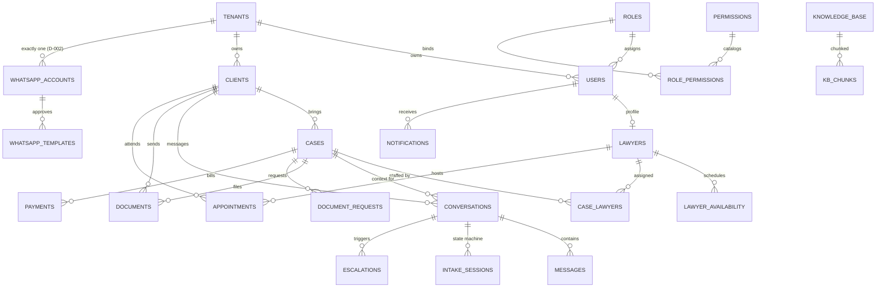

# Phase 3 — Database Design

**Status:** Delivered 2026-08-12 · implements D-001, ADR-002/003/004
**Artifacts:** `apps/api/prisma/schema.prisma` (30 models, validated, client generates) · `apps/api/prisma/migrations/0001_init` (generated DDL, 860 lines) · `0002_rls_and_constraints` · `0003_partitions_and_vector` · `infra/postgres/init.sql`

---

## 1. Goal & Definition of Done

**Goal:** Complete PostgreSQL schema covering every entity in the brief's database scope, with tenant isolation enforced at the database layer, plus the indexing/partitioning plan for the Phase 1 scale targets.

**Done when:**
- [x] All scope entities modeled: Tenants, Users, Lawyers, Cases, Messages, Conversation State, Documents, Appointments, Payments, Notifications, Audit Logs, Roles, Permissions, AI Logs, Prompt Logs, Vector Embeddings, Knowledge Base (+ webhook inbox, outbox, escalations, intake sessions, WhatsApp accounts/templates the brief's later phases imply)
- [x] Every tenant-owned table carries `tenantId`; isolation enforced via RLS + FORCE at DB layer
- [x] Partitioning/indexing plan stated with numbers; unbounded tables partitioned
- [x] Migration strategy defined (owner vs app role; generated vs hand-written)
- [x] `prisma validate` passes; client generates

**Not yet verified (env limitation):** no Docker/Postgres in this build environment, so `migrate deploy` + the RLS cross-tenant test suite run on a dev machine/CI. This is the first CI gate to stand up (Phase 17). Migrations were statically verified and follow replayable-from-scratch ordering.

---

## 2. Key Decisions & Trade-offs

### D-019 — Two schemas: `platform` (infrastructure) vs `app` (tenant-owned, RLS)
`platform` holds the tenant registry, webhook inbox, outbox, permission catalog, prompt registry — the *pipes*. `app` holds tenant-owned data — the *data*. Rationale: RLS policies stay uniform in `app` (one policy shape on every table) while infrastructure tables that must be read cross-tenant by workers (outbox dispatcher) never sit behind a tenant GUC. Rejected: single schema with per-table exceptions (policy drift — exactly the class of mistake RLS is meant to prevent); three-schema split with `audit` separate (no operational gain, more grant surface).

### D-020 — RLS mechanics
Policy on every `app` table: `("tenantId") = NULLIF(current_setting('app.tenant_id', true), '')::uuid` — **fail-closed**: unset/empty GUC yields NULL → zero rows. `ENABLE` + `FORCE` so even the table owner is bound; app connects as `app_user` (non-owner, `NOBYPASSRLS`); migrations run as owner with `BYPASSRLS` (deploy-pipeline role only). `platform.tenants` gets a self-read policy so a firm can read its own settings and nobody else's. Rejected: policy via `current_user`-based mapping table (extra lookup per query, same failure modes); session GUC without `NULLIF` guard (empty-string cast crash instead of clean zero-rows).

### D-021 — Unbounded tables partitioned monthly: `messages`, `audit_logs`, `ai_logs`
RANGE on `createdAt`; 6 months pre-created + DEFAULT safety net; retention = `DROP PARTITION`. PK becomes `(id, createdAt)` because PG requires the partition key in the PK — the schema declares composite `@@id` so Prisma's view stays truthful and the CI drift gate passes. Consequence accepted: **no unique constraint on `messages.wamid`** (uniques must include the partition key) — inbound idempotency is anchored on `platform.webhook_events.externalEventId` (unpartitioned, unique) instead, which is the correct layer anyway (ADR-004). Rejected: partition all tables (most tenant tables are small per-tenant; partitioning adds planning overhead for nothing); pg_partman dependency (a DO-block + ops cron covers it without an extension dependency v1; pg_partman noted as the Phase-15 upgrade path if partition count grows).

### D-022 — Vector storage: `vector(1536)` + HNSW, embeddings as raw SQL only
`text-embedding-3-large` **requested at 1536 dimensions** — full-precision `vector` type (HNSW supports ≤2000 dims for `vector`; 3072 would force `halfvec` and double storage). Cosine ops, `m=16, ef_construction=64` (pgvector defaults — tuned in Phase 8 with recall measurements, not guessed now). The column is `Unsupported("vector(1536)")` in Prisma — written/read via `$queryRaw` only, which is what we want: all retrieval goes through one hand-audited query with an explicit `tenantId` filter **and** RLS behind it (FR-KB-02's double guard). Rejected: 3072-dim full embeddings (storage + precision trade-off), separate vector DB (Qdrant/Weaviate — another stateful system to isolate per tenant and back up; pgvector at our scale is sufficient: 10k tenants × ~50k chunks is well within HNSW comfort).

### D-023 — Money and cost encodings
Money: integer minor units (`amountCents` + `CHAR(3)` currency) — floats never touch money. LLM cost: integer USD **micros** (a $0.000002 token delta still aggregates correctly; floats drift). Rejected: `NUMERIC` (correct but slower and invites mixed-precision arithmetic in app code; integer cents with explicit currency is the boring, auditable choice).

### D-024 — Per-tenant WhatsApp credentials encrypted at the column level
`whatsapp_accounts.accessTokenEnc` = AES-256-GCM ciphertext, key from `MASTER_ENCRYPTION_KEY` env (KMS/Vault in Phase 15). The DB alone is never sufficient to decrypt a firm's WABA token. Rejected: plaintext column + disk encryption (a backup dump or SQLi read = every tenant's WhatsApp token); per-tenant KMS keys (overkill v1; single master key with rotation runbook is proportionate).

### D-025 — Migration strategy: generated base + hand-written platform layers
`0001` is generated by `prisma migrate diff --from-empty --to-schema` (single source of truth = the schema file); `0002` (roles/grants/RLS/exclusion constraint/partial indexes) and `0003` (partition conversion + HNSW) are hand-written and replayable from scratch — 0003's partition conversion runs on empty tables by construction. Drift gate for CI: `prisma migrate diff --from-migrations --to-schema` must be empty (Phase 17). Rejected: `db push` workflow (no history, no review); fully hand-written DDL (schema.prisma stops being source of truth, drift guaranteed).

### D-026 — Prisma 7 adopted deliberately
`prisma-client` generator + `@prisma/adapter-pg` (query compiler, no Rust engine), URLs in `prisma.config.ts`, owner/app role split via `MIGRATION_DATABASE_URL` vs `DATABASE_URL`. The brief's "Prisma" without a version would have landed on superseded v5/v6 patterns (`prisma-client-js`, `.env` autoload, schema-file URLs); v7 is the current stable line and the adapter API is also what lets us pin `SET LOCAL app.tenant_id` inside every transaction cleanly.

---

## 3. ER Diagram (core relations; audit/log/infra tables omitted for readability)

## 4. Indexing & Partitioning Plan

| Table | Shape at year-1 targets (proposed) | Plan |
|---|---|---|
| `messages` | ~230M rows/yr @ 2k tenants | Monthly partitions; `(conversationId, createdAt)` for thread reads; `(tenantId, createdAt)`; `(wamid)` lookup; BRIN not needed (partition pruning covers time scans) |
| `audit_logs` | ~50M rows/yr | Monthly partitions, append-only (UPDATE/DELETE revoked), `(tenantId, createdAt)`, `(tenantId, entityType, entityId)` |
| `ai_logs` | ~45M rows/yr (1.5M calls/day) | Monthly partitions, `(tenantId, createdAt)`, `(correlationId)` for trace lookup |
| `kb_chunks` | ≤ ~500k rows/tenant, typically « | HNSW `(embedding vector_cosine_ops)` + `(tenantId, kbId)`; tenant filter + RLS on every retrieval |
| `conversations` | ~80k new/day platform-wide | `(tenantId, state)` powers the inbox filter; `(tenantId, clientId)` |
| `appointments` | modest | `(tenantId, lawyerId, startsAt)` + **exclusion constraint** `no_double_booking` (gist, tstzrange, active statuses only) |
| `payments` | modest | `(tenantId, status)`, `(tenantId, caseId)`, partial unique `(tenantId, providerTxnId) WHERE NOT NULL` (rail webhook idempotency) |
| `notifications` | hot reads | partial `(tenantId, userId) WHERE readAt IS NULL` |
| `escalations` | small, latency-critical | partial `(tenantId, slaDeadline) WHERE status='OPEN'` |
| everything else | small per tenant | PK + tenant-leading composites as declared in schema |

Standing rule: every new tenant-owned table gets `(tenantId, …)`-leading indexes and the standard RLS policy — enforced by the Phase 17 schema-lint test, not by memory.

## 5. Migration Strategy & Roles

| Role | Used by | Rights |
|---|---|---|
| owner (`postgres` dev / deploy role prod, `BYPASSRLS`) | `prisma migrate deploy` via `MIGRATION_DATABASE_URL` | DDL, migration DML |
| `app_user` (non-owner, `NOBYPASSRLS`) | API + worker via `DATABASE_URL` | DML on `app` (RLS-bound), narrow `platform` grants; **no** UPDATE/DELETE on `audit_logs`; no DDL |

**Apply order (replayable from scratch):** `init.sql` (docker only: extensions/role for local dev) → `0001_init` (schemas, enums, tables, FKs, indexes) → `0002_rls_and_constraints` → `0003_partitions_and_vector`.

## 6. Security Considerations (phase-specific)

- Isolation is DB-enforced (D-020); the app-layer `tenantId` filters in Phase 4 are defense-in-depth, not the control.
- `webhook_events.payload` can hold T2/T3 — `platform` schema, narrow grants, payload nulled after processing (Phase 6 implements the trim).
- `ai_logs`/`prompt_logs` store redacted I/O only (T2 discipline); the schema has no column capable of holding a raw document.
- WABA tokens encrypted at column level (D-024).
- Append-only audit is enforced by privilege revocation, not convention.

## 7. Open Questions, Risks & Assumptions

- **Risk:** migration role needs `BYPASSRLS` in prod — provisioned in Phase 15; documented as a deploy prerequisite.
- **Risk:** partition-creation ops job forgetting a month is masked by the DEFAULT partition — monitor `*_default` emptiness (Phase 16 alert).
- **OQ-9 (new):** tenant timezone storage — v1 keeps firm timezone in `tenants.settings` (single-timezone firms). Multi-office firms with several timezones are a Phase 12 concern.
- **Assumption:** `vector(1536)` via dimension-reduction keeps Urdu/Roman-Urdu retrieval quality ≥ 3072-dim within measurement noise — **verified with the eval harness in Phase 8**, not assumed into production.

## 8. Decision Log Updates

D-019 (two-schema split), D-020 (RLS mechanics), D-021 (monthly partitions for messages/audit/ai + composite-PK consequence), D-022 (1536-dim HNSW, raw-SQL-only vectors), D-023 (integer money/micros), D-024 (column-level AES-GCM for tenant secrets), D-025 (generated base + hand-written layers + CI drift gate), D-026 (Prisma 7 stack) — appended to `docs/decision-log.md`.
